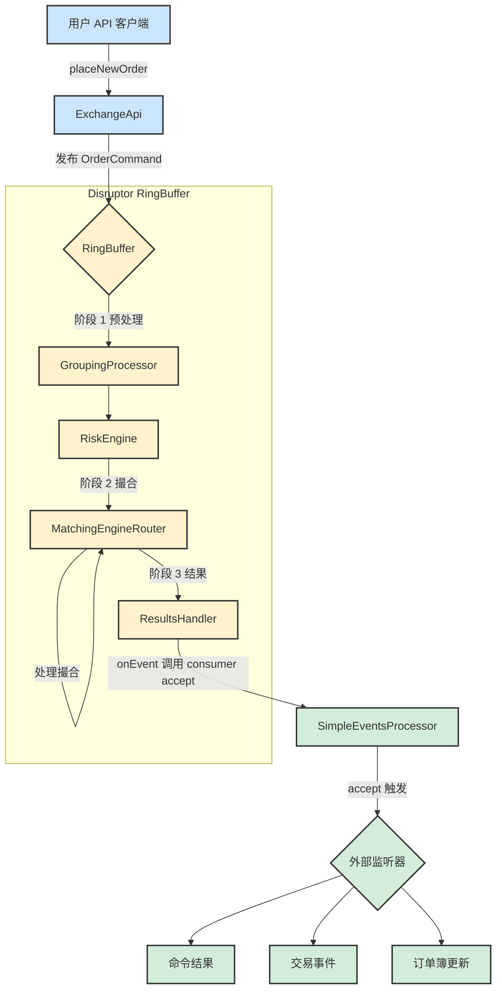

# 系统架构和订单流

本文档描述了交易核心的架构，重点关注订单命令的生命周期。

## 订单流图

下图说明了命令从 API 到最终事件消费者的流转过程。



## 组件描述

以下是处理流水线中每个组件角色的详细分解：

### 客户端
*   **用户 API 客户端**: 代表与交易所交互的任何外部应用程序或用户脚本。它通过发送命令（如放置或取消订单）来发起操作。

### [交易核心 (Disruptor RingBuffer)](https://github.com/C18519898242/exchange-core/blob/master/src/main/java/exchange/core2/core/ExchangeCore.java)
这是系统的高性能、低延迟核心，基于 LMAX Disruptor 模式构建。整个处理流水线在 `ExchangeCore.java` 类中进行配置和编排。

*   **ExchangeApi**: 面向公众的交易所网关。它提供了一个用户友好的 API，并负责将外部调用（例如 `placeNewOrder`）转换为内部的 `OrderCommand` 格式。然后，它将这些命令发布到 `RingBuffer` 上进行处理。

*   **RingBuffer**: Disruptor 框架的核心数据结构。它是一个预先分配的环形缓冲区，`OrderCommand` 对象存活于此。所有处理阶段（处理器）都直接操作此缓冲区中的对象，从而实现了组件之间无锁、高吞吐量的通信。

*   **GroupingProcessor (阶段 1)**: 这是流水线中的第一个处理器。其主要功能是将传入的命令分组成批次。这是一种性能优化，通过减少处理每个命令的开销来提高吞吐量。分组是基于可配置的大小限制或时间阈值形成的。

*   **RiskEngine (阶段 1)**: 第二个处理器，负责交易前风险管理和用户账户状态。它是一个有状态的组件，维护所有用户资料、余额和头寸。当收到 `PLACE_ORDER` 命令时，它会检查用户是否有足够的资金或保证金来覆盖该订单。它将拒绝任何未通过这些风险检查的命令。它还处理诸如余额调整和用户创建之类的管理任务。

*   **MatchingEngineRouter (阶段 2)**: 第三个处理器，是撮合逻辑的核心。它接收已通过 `RiskEngine` 清算的命令，并根据命令的交易对将其路由到相应的 `IOrderBook` 实例。它执行核心的撮合算法，从而产生交易、拒绝或修改订单簿。结果作为 `MatcherTradeEvent` 对象链附加到 `OrderCommand` 上。它还负责生成 L2 市场数据快照。

*   **ResultsHandler (阶段 3)**: Disruptor 流水线中的最后一个处理器。其作用简单但至关重要：它接收完全处理过的 `OrderCommand`——现在已富含最终结果代码和撮合事件链——并将其传递给指定的下游事件消费者。

### 事件处理
*   **SimpleEventsProcessor**: 该组件充当主要的下游消费者。它从 `ResultsHandler` 接收处理过的 `OrderCommand`，并将内部复杂的的数据结构转换为适用于外部系统的干净、离散的事件。它“解包”命令以产生 `CommandResult`（高级别结果）、`TradeEvent`（详细交易信息）和 `OrderBook`（市场数据更新）。

*   **外部监听器**: 这代表了 `SimpleEventsProcessor` 生成的事件的最终目的地。这些是订阅事件流以与交易所状态保持同步的客户端应用程序、数据库、UI 前端或分析系统。

---

## API 用法: `ExchangeApi` 深度解析

`ExchangeApi` 类是整个交易核心的入口和门面（Facade）。它为外部客户端提供了一套清晰、易于使用的接口，同时将底层 Disruptor 框架的复杂性抽象出来。其核心职责包括：

1.  **API 门面**: 它封装了与 Disruptor `RingBuffer` 交互的复杂性。开发者只需调用如 `submitCommand(ApiPlaceOrder cmd)` 这样的简单方法，而无需理解内部机制。
2.  **命令翻译与发布**: 它的核心任务是将 `ApiCommand` 对象翻译成内部的 `OrderCommand` 格式。它使用预定义的 `EventTranslator` 将字段复制到 `RingBuffer` 上的一个预分配 `OrderCommand` 对象中，然后发布它，使其对处理流水线可见。
3.  **异步结果处理**: 对于异步调用，`ExchangeApi` 维护一个 `promises` 映射。它根据命令的序列号存储一个 `CompletableFuture` 的回调。当命令处理完毕，`ResultsHandler` 会调用 `ExchangeApi.processResult()`，该方法会找到对应的回调并完成 `Future`，从而将结果传递给原始调用者。

#### `submitCommandAsync` 与 `submitCommandAsyncFullResponse` 的区别

核心区别在于 `CompletableFuture` 返回的信息量：

*   **`submitCommandAsync`**:
    *   **返回**: `CompletableFuture<CommandResultCode>`
    *   **内容**: 仅包含最终的状态码（如 `SUCCESS`, `RISK_NSF` 等）。
    *   **应用场景**: 当您只关心操作是否成功，而不需要其副作用的细节时，这是理想的选择。

*   **`submitCommandAsyncFullResponse`**:
    *   **返回**: `CompletableFuture<OrderCommand>`
    *   **内容**: 整个处理完毕的 `OrderCommand` 对象，包含 `resultCode`、`MatcherTradeEvent` 链（交易明细）以及可能的 `L2MarketData`。
    *   **应用场景**: 当您需要操作结果的全部细节时（例如市价单的平均成交价和每笔成交详情），此方法是必需的。

#### 异步使用模式

与 API 进行异步交互的标准方式是：

1.  **调用 `async` 方法**: `CompletableFuture<OrderCommand> future = exchangeApi.submitCommandAsyncFullResponse(placeOrderCmd);`
2.  **处理 `Future`**:
    *   **阻塞式等待 (用于测试)**: `OrderCommand result = future.join();`
    *   **非阻塞式回调 (推荐)**: `future.thenAccept(result -> { /* 在此处理结果 */ });`

---

## Disruptor 流水线编排

`RingBuffer` 本身只是一个高性能的、无锁的环形队列，它负责存储和传递数据（在这里是 `OrderCommand` 对象）。**它本身并不直接“编排”各个 Stage，而是通过一种叫做“依赖屏障”（Dependency Barrier）的机制来实现的。**

这个编排过程是在 `ExchangeCore` 的构造函数中定义的，我们可以把它想象成一个“依赖关系图”的构建过程。让我们来梳理一下：

1.  **基本概念：Sequence 和 Barrier**
    *   **Sequence**: 每个处理器（Processor）都有一个自己的 `Sequence` 对象。这可以看作是这个处理器当前处理到了 `RingBuffer` 中的哪个位置（序列号）的“计数器”。
    *   **SequenceBarrier**: 这是一个“屏障”。一个处理器在处理下一个数据之前，必须等待它所依赖的所有前置处理器的 `Sequence` 都越过这个数据的位置。这个屏障确保了处理器不会处理尚未被其前置依赖处理过的数据。

2.  **编排 Stage 1, 2, 3 的过程**
    在 `ExchangeCore.java` 中，您会看到类似这样的代码（这是 LMAX Disruptor 的标准设置模式）：
    ```java
    // 1. 从 RingBuffer 创建一个初始屏障，所有第一阶段的处理器都依赖它
    SequenceBarrier barrier1 = ringBuffer.newBarrier();

    // 2. 创建 Stage 1 的处理器 (Grouping, Risk)，它们都等待 barrier1
    //    - GroupingProcessor(barrier1)
    //    - RiskEngine(barrier1)
    //    这两个处理器可以并行执行，因为它们没有相互依赖，只依赖 RingBuffer 的原始数据。

    // 3. 创建 Stage 2 的屏障，它等待 Stage 1 的所有处理器完成
    //    这个屏障会跟踪 GroupingProcessor 和 RiskEngine 的 Sequence
    SequenceBarrier barrier2 = ringBuffer.newBarrier(
        groupingProcessor.getSequence(), 
        riskEngine.getSequence()
    );

    // 4. 创建 Stage 2 的处理器 (MatchingEngine)，它等待 barrier2
    //    - MatchingEngineRouter(barrier2)
    //    这意味着 MatchingEngineRouter 必须等到 GroupingProcessor 和 RiskEngine 
    //    都处理完同一个 OrderCommand 后，才能开始处理它。

    // 5. 创建 Stage 3 的屏障，它等待 Stage 2 的处理器完成
    SequenceBarrier barrier3 = ringBuffer.newBarrier(
        matchingEngineRouter.getSequence()
    );

    // 6. 创建 Stage 3 的处理器 (ResultsHandler)，它等待 barrier3
    //    - ResultsHandler(barrier3)
    ```

3.  **工作流程（以一个 `OrderCommand` 为例）**
    *   **发布**: `ExchangeApi` 将一个 `OrderCommand` 发布到 `RingBuffer` 的序列号 `N`。
    *   **Stage 1**:
        *   `GroupingProcessor` 和 `RiskEngine` 都在等待 `barrier1`。一旦序列号 `N` 可用，它们俩都可以开始处理 `RingBuffer[N]` 里的这个命令。
        *   它们各自完成处理后，会更新自己的 `Sequence` 到 `N`。
    *   **Stage 2**:
        *   `MatchingEngineRouter` 在等待 `barrier2`。`barrier2` 会检查 `GroupingProcessor` 和 `RiskEngine` 的 `Sequence`。只有当这两个 `Sequence` 都达到或超过 `N` 时，`barrier2` 才会放行。
        *   `barrier2` 放行后，`MatchingEngineRouter` 开始处理 `RingBuffer[N]` 的命令。处理完成后，它也更新自己的 `Sequence` 到 `N`。
    *   **Stage 3**:
        *   `ResultsHandler` 在等待 `barrier3`。`barrier3` 检查 `MatchingEngineRouter` 的 `Sequence`。一旦它达到 `N`，`barrier3` 就放行。
        *   `ResultsHandler` 开始处理，并最终完成对这个命令的所有操作。

**总结**
`RingBuffer` 就像一条物理的流水线传送带，而**编排是通过 `SequenceBarrier` 实现的**。每个 `SequenceBarrier` 都像流水线上的一个“检查点”，它确保只有在所有前序工位（依赖的处理器）都完成了对某个零件（`OrderCommand`）的操作后，这个零件才能流转到下一个工位。

通过这种方式，Disruptor 巧妙地定义了处理器之间的依赖关系和执行顺序，实现了高效的、无锁的并行和串行处理流程。

---

## GroupingProcessor 组件深度解析

`GroupingProcessor` 是 Disruptor 流水线中的**第一个处理器**，它是一个非常关键的**性能优化组件**。它的核心思想很简单：**将单个的命令聚合成批次（Batches），然后将整个批次传递给下一个处理器**。

这就像在快餐店点餐，如果每个顾客点一个汉堡，厨师就做一个汉堡，效率会很低。但如果收银员（`GroupingProcessor`）把连续 10 个汉堡的订单收集起来，一次性交给后厨（`RiskEngine`），后厨就可以流水线作业，大大提高效率。

让我们深入了解它的工作机制：

1.  **目的：提升吞吐量 (Throughput)**
    *   在超低延迟的系统中，处理单个事件的固定开销（比如方法调用、缓存未命中等）可能会变得非常显著。
    *   通过将命令分组，`GroupingProcessor` 将多个命令的处理成本“摊销”了。下游的处理器（如 `RiskEngine`）只需要被唤醒一次就可以处理一批命令，而不是每个命令都被唤醒一次。这极大地减少了上下文切换和处理器间的通信开销，从而显著提升了系统的总吞吐量。

2.  **工作原理**
    *   `GroupingProcessor` 在 `onEvent` 方法中接收从 `RingBuffer` 传来的 `OrderCommand`。
    *   它并**不立即**将这个命令传递下去，而是先把它“扣留”下来。
    *   它会检查这个命令是否是一个“**触发信号**”。在 `exchange-core` 中，这个信号通常是 `GROUPING_FLUSH_SIGNAL` 命令，或者是一个特殊的 `endOfBatch` 标志。
    *   当 `GroupingProcessor` 收到一个触发信号，或者它“扣留”的命令数量达到了一个预设的阈值（`groupingMaxBatchSize`），或者等待时间超过了某个阈值（`groupingMaxBatchDelayNs`），它就会把当前积累的所有命令作为一个“批次”的结束，然后更新自己的 `Sequence`。
    *   这个 `Sequence` 的更新会触发 `SequenceBarrier`，从而让下游的 `RiskEngine` 知道：“从上一个批次的结束点到现在这个点，所有的命令都准备好了，你可以开始处理了。”

3.  **分组的边界**
    分组的触发条件主要有两种：
    *   **数量阈值**: 当累积的命令数量达到 `ExchangeConfiguration.ordersProcessing.groupingMaxBatchSize` 时，就触发一次“刷盘”（Flush）。
    *   **时间阈值**: 为了避免在高负载时命令被无限期延迟，系统会定期发送一个 `GROUPING_FLUSH_SIGNAL`。这个信号就像一个闹钟，告诉 `GroupingProcessor`：“不管你现在攒了多少命令，都立刻打包发走”。这确保了延迟的上限。

**总结**
`GroupingProcessor` 是一个典型的“**批处理**”优化。它牺牲了单个命令的**最低延迟**（因为命令需要等待成组），来换取整个系统**更高的总吞t量**。在金融交易这种需要处理海量并发请求的场景下，这种权衡是非常常见且有效的。它和 `RiskEngine` 一起构成了 Stage 1，为后续的撮合阶段准备好了一批批经过预处理的命令。
