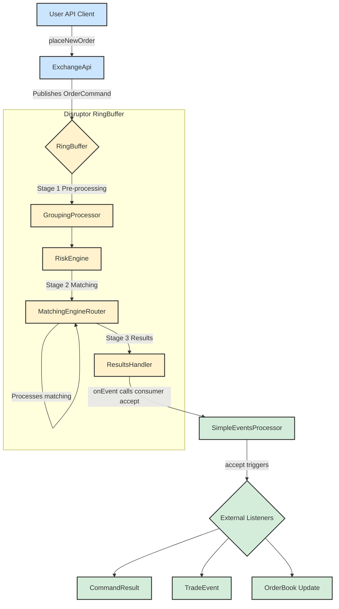

# System Architecture and Order Flow

This document describes the architecture of the exchange core, focusing on the life cycle of an order command.

## Order Flow Diagram

The following diagram illustrates the journey of a command from the API to the final event consumers.



## Component Descriptions

Here is a detailed breakdown of each component's role in the processing pipeline:

### Client
*   **User API Client**: Represents any external application or user script that interacts with the exchange. It initiates actions by sending commands, such as placing or canceling orders.

### [Exchange Core (Disruptor RingBuffer)](https://github.com/C18519898242/exchange-core/blob/master/src/main/java/exchange/core2/core/ExchangeCore.java)
This is the high-performance, low-latency core of the system, built on the LMAX Disruptor pattern. The entire processing pipeline is configured and orchestrated in the `ExchangeCore.java` class.

*   **ExchangeApi**: The public-facing gateway to the exchange. It provides a user-friendly API and is responsible for translating external calls (e.g., `placeNewOrder`) into the internal `OrderCommand` format. It then publishes these commands onto the `RingBuffer` for processing.

*   **RingBuffer**: The central data structure of the Disruptor framework. It's a pre-allocated circular buffer where `OrderCommand` objects live. All processing stages (processors) operate on the objects directly within this buffer, which enables lock-free, high-throughput communication between components.

*   **GroupingProcessor (Stage 1)**: This is the first processor in the pipeline. Its primary function is to batch incoming commands into groups. This is a performance optimization that improves throughput by reducing the overhead of processing each command individually. Groups are formed based on a configurable size limit or a time-based threshold.

*   **RiskEngine (Stage 1)**: The second processor, responsible for pre-trade risk management and user account state. It's a stateful component that maintains all user profiles, balances, and positions. When it receives a `PLACE_ORDER` command, it checks if the user has sufficient funds or margin to cover the order. It will reject any command that fails these risk checks. It also handles administrative tasks like balance adjustments and user creation.

*   **MatchingEngineRouter (Stage 2)**: The third processor and the heart of the matching logic. It takes commands that have been cleared by the `RiskEngine` and routes them to the appropriate `IOrderBook` instance based on the command's symbol. It executes the core matching algorithm, which results in trades, rejections, or modifications to the order book. The outcomes are attached to the `OrderCommand` as a chain of `MatcherTradeEvent` objects. It is also responsible for generating L2 market data snapshots.

*   **ResultsHandler (Stage 3)**: The final processor in the Disruptor pipeline. Its role is simple but crucial: it takes the fully processed `OrderCommand`—now enriched with a final result code and a chain of matcher events—and passes it to the designated downstream event consumer.

### Event Handling
*   **SimpleEventsProcessor**: This component acts as the primary downstream consumer. It receives the processed `OrderCommand` from the `ResultsHandler` and translates the internal, complex data structures into clean, discrete events suitable for external systems. It "unpacks" the command to produce `CommandResult` (the high-level outcome), `TradeEvent` (detailed trade information), and `OrderBook` (market data updates).

*   **External Listeners**: This represents the final destination for the events generated by the `SimpleEventsProcessor`. These are the client-side applications, databases, UI frontends, or analytics systems that subscribe to the event stream to stay synchronized with the state of the exchange.

---

## API Usage: `ExchangeApi` Deep Dive

### English

The `ExchangeApi` class serves as the entry point and facade for the entire trading core. It provides a clear, user-friendly interface for external clients, abstracting away the complexities of the underlying Disruptor framework. Its key responsibilities include:

1.  **API Facade**: It hides the complexity of interacting with the Disruptor `RingBuffer`. Developers call simple methods like `submitCommand(ApiPlaceOrder cmd)` without needing to understand the internal mechanics.
2.  **Command Translation & Publishing**: Its core duty is to translate `ApiCommand` objects into the internal `OrderCommand` format. It uses a predefined `EventTranslator` to copy fields into a pre-allocated `OrderCommand` on the `RingBuffer` and then publishes it, making it visible to the processing pipeline.
3.  **Asynchronous Result Handling**: For async calls, `ExchangeApi` maintains a map of `promises`. It stores a `CompletableFuture` callback against a command's sequence number. When the command is fully processed, the `ResultsHandler` invokes `ExchangeApi.processResult()`, which finds the corresponding callback and completes the future, delivering the result to the original caller.

#### `submitCommandAsync` vs `submitCommandAsyncFullResponse`

The key difference lies in the amount of information returned in the `CompletableFuture`:

*   **`submitCommandAsync`**:
    *   **Returns**: `CompletableFuture<CommandResultCode>`
    *   **Content**: Only the final status code (`SUCCESS`, `RISK_NSF`, etc.).
    *   **Use Case**: Ideal when you only need to know if an operation succeeded or failed, without needing the details of its side effects.

*   **`submitCommandAsyncFullResponse`**:
    *   **Returns**: `CompletableFuture<OrderCommand>`
    *   **Content**: The entire, fully-processed `OrderCommand` object, which includes the `resultCode`, a chain of `MatcherTradeEvent`s (trades), and potentially `L2MarketData`.
    *   **Use Case**: Essential when you need the full details of the operation's outcome, such as the average fill price and trade-by-trade specifics of a market order.

#### Asynchronous Usage Pattern

The standard way to interact with the API asynchronously is:

1.  **Call an `async` method**: `CompletableFuture<OrderCommand> future = exchangeApi.submitCommandAsyncFullResponse(placeOrderCmd);`
2.  **Process the `Future`**:
    *   **Blocking Wait (for tests)**: `OrderCommand result = future.join();`
    *   **Non-Blocking Callback (recommended)**: `future.thenAccept(result -> { /* process result here */ });`

---

### 中文

`ExchangeApi` 类是整个交易核心的入口和门面（Facade）。它为外部客户端提供了一套清晰、易于使用的接口，同时将底层 Disruptor 框架的复杂性抽象出来。其核心职责包括：

1.  **API 门面**: 它封装了与 Disruptor `RingBuffer` 交互的复杂性。开发者只需调用如 `submitCommand(ApiPlaceOrder cmd)` 这样的简单方法，而无需理解内部机制。
2.  **命令翻译与发布**: 它的核心任务是将 `ApiCommand` 对象翻译成内部的 `OrderCommand` 格式。它使用预定义的 `EventTranslator` 将字段复制到 `RingBuffer` 上的一个预分配 `OrderCommand` 对象中，然后发布它，使其对处理流水线可见。
3.  **异步结果处理**: 对于异步调用，`ExchangeApi` 维护一个 `promises` 映射。它根据命令的序列号存储一个 `CompletableFuture` 的回调。当命令处理完毕，`ResultsHandler` 会调用 `ExchangeApi.processResult()`，该方法会找到对应的回调并完成 `Future`，从而将结果传递给原始调用者。

#### `submitCommandAsync` 与 `submitCommandAsyncFullResponse` 的区别

核心区别在于 `CompletableFuture` 返回的信息量：

*   **`submitCommandAsync`**:
    *   **返回**: `CompletableFuture<CommandResultCode>`
    *   **内容**: 仅包含最终的状态码（如 `SUCCESS`, `RISK_NSF` 等）。
    *   **应用场景**: 当您只关心操作是否成功，而不需要其副作用的细节时，这是理想的选择。

*   **`submitCommandAsyncFullResponse`**:
    *   **返回**: `CompletableFuture<OrderCommand>`
    *   **内容**: 整个处理完毕的 `OrderCommand` 对象，包含 `resultCode`、`MatcherTradeEvent` 链（交易明细）以及可能的 `L2MarketData`。
    *   **应用场景**: 当您需要操作结果的全部细节时（例如市价单的平均成交价和每笔成交详情），此方法是必需的。

#### 异步使用模式

与 API 进行异步交互的标准方式是：

1.  **调用 `async` 方法**: `CompletableFuture<OrderCommand> future = exchangeApi.submitCommandAsyncFullResponse(placeOrderCmd);`
2.  **处理 `Future`**:
    *   **阻塞式等待 (用于测试)**: `OrderCommand result = future.join();`
    *   **非阻塞式回调 (推荐)**: `future.thenAccept(result -> { /* 在此处理结果 */ });`

---

## Disruptor Pipeline Orchestration

### English

The `RingBuffer` itself is just a high-performance, lock-free circular queue responsible for storing and passing data (in this case, `OrderCommand` objects). **It does not directly "orchestrate" the stages; instead, this is achieved through a mechanism called a "Dependency Barrier."**

This orchestration process is defined in the `ExchangeCore` constructor, which can be thought of as building a "dependency graph." Let's break it down:

1.  **Core Concepts: Sequence and Barrier**
    *   **Sequence**: Each processor has its own `Sequence` object. This acts as a "counter" for the position (sequence number) in the `RingBuffer` that the processor has currently handled.
    *   **SequenceBarrier**: This is a barrier. Before processing the next item, a processor must wait for the `Sequence` of all its prerequisite processors to advance past that item's position. This barrier ensures that a processor does not handle data that has not yet been processed by its dependencies.

2.  **Orchestrating Stages 1, 2, and 3**
    In `ExchangeCore.java`, you will see code like this (this is the standard LMAX Disruptor setup pattern):
    ```java
    // 1. Create an initial barrier from the RingBuffer, which all Stage 1 processors depend on.
    SequenceBarrier barrier1 = ringBuffer.newBarrier();

    // 2. Create Stage 1 processors (Grouping, Risk), both waiting for barrier1.
    //    - GroupingProcessor(barrier1)
    //    - RiskEngine(barrier1)
    //    These two processors can execute in parallel as they have no dependency on each other, only on the raw data from the RingBuffer.

    // 3. Create a Stage 2 barrier that waits for all Stage 1 processors to complete.
    //    This barrier will track the Sequences of GroupingProcessor and RiskEngine.
    SequenceBarrier barrier2 = ringBuffer.newBarrier(
        groupingProcessor.getSequence(), 
        riskEngine.getSequence()
    );

    // 4. Create the Stage 2 processor (MatchingEngine), which waits for barrier2.
    //    - MatchingEngineRouter(barrier2)
    //    This means MatchingEngineRouter must wait until both GroupingProcessor and RiskEngine
    //    have finished processing the same OrderCommand before it can begin.

    // 5. Create a Stage 3 barrier that waits for the Stage 2 processor to complete.
    SequenceBarrier barrier3 = ringBuffer.newBarrier(
        matchingEngineRouter.getSequence()
    );

    // 6. Create the Stage 3 processor (ResultsHandler), which waits for barrier3.
    //    - ResultsHandler(barrier3)
    ```

3.  **Workflow (Example with one `OrderCommand`)**
    *   **Publish**: `ExchangeApi` publishes an `OrderCommand` to sequence number `N` on the `RingBuffer`.
    *   **Stage 1**:
        *   `GroupingProcessor` and `RiskEngine` are both waiting for `barrier1`. Once sequence `N` is available, they can both start processing the command in `RingBuffer[N]`.
        *   After they each finish processing, they update their own `Sequence` to `N`.
    *   **Stage 2**:
        *   `MatchingEngineRouter` waits for `barrier2`. `barrier2` checks the `Sequence` of both `GroupingProcessor` and `RiskEngine`. Only when both sequences have reached or surpassed `N` does `barrier2` give the green light.
        *   Once cleared, `MatchingEngineRouter` processes the command at `RingBuffer[N]`. After completion, it updates its `Sequence` to `N`.
    *   **Stage 3**:
        *   `ResultsHandler` waits for `barrier3`. `barrier3` checks the `Sequence` of `MatchingEngineRouter`. Once it reaches `N`, `barrier3` gives the green light.
        *   `ResultsHandler` begins processing, completing all operations for this command.

**Summary**
The `RingBuffer` is like a physical assembly line conveyor belt, while **orchestration is implemented via the `SequenceBarrier`**. Each `SequenceBarrier` acts like a "checkpoint" on the assembly line, ensuring that a part (`OrderCommand`) can only move to the next station after all previous stations (dependent processors) have completed their work on it.

In this way, Disruptor elegantly defines the dependencies and execution order among processors, achieving an efficient, lock-free, parallel, and serial processing flow.

### 中文

`RingBuffer` 本身只是一个高性能的、无锁的环形队列，它负责存储和传递数据（在这里是 `OrderCommand` 对象）。**它本身并不直接“编排”各个 Stage，而是通过一种叫做“依赖屏障”（Dependency Barrier）的机制来实现的。**

这个编排过程是在 `ExchangeCore` 的构造函数中定义的，我们可以把它想象成一个“依赖关系图”的构建过程。让我们来梳理一下：

1.  **基本概念：Sequence 和 Barrier**
    *   **Sequence**: 每个处理器（Processor）都有一个自己的 `Sequence` 对象。这可以看作是这个处理器当前处理到了 `RingBuffer` 中的哪个位置（序列号）的“计数器”。
    *   **SequenceBarrier**: 这是一个“屏障”。一个处理器在处理下一个数据之前，必须等待它所依赖的所有前置处理器的 `Sequence` 都越过这个数据的位置。这个屏障确保了处理器不会处理尚未被其前置依赖处理过的数据。

2.  **编排 Stage 1, 2, 3 的过程**
    在 `ExchangeCore.java` 中，您会看到类似这样的代码（这是 LMAX Disruptor 的标准设置模式）：
    ```java
    // 1. 从 RingBuffer 创建一个初始屏障，所有第一阶段的处理器都依赖它
    SequenceBarrier barrier1 = ringBuffer.newBarrier();

    // 2. 创建 Stage 1 的处理器 (Grouping, Risk)，它们都等待 barrier1
    //    - GroupingProcessor(barrier1)
    //    - RiskEngine(barrier1)
    //    这两个处理器可以并行执行，因为它们没有相互依赖，只依赖 RingBuffer 的原始数据。

    // 3. 创建 Stage 2 的屏障，它等待 Stage 1 的所有处理器完成
    //    这个屏障会跟踪 GroupingProcessor 和 RiskEngine 的 Sequence
    SequenceBarrier barrier2 = ringBuffer.newBarrier(
        groupingProcessor.getSequence(), 
        riskEngine.getSequence()
    );

    // 4. 创建 Stage 2 的处理器 (MatchingEngine)，它等待 barrier2
    //    - MatchingEngineRouter(barrier2)
    //    这意味着 MatchingEngineRouter 必须等到 GroupingProcessor 和 RiskEngine 
    //    都处理完同一个 OrderCommand 后，才能开始处理它。

    // 5. 创建 Stage 3 的屏障，它等待 Stage 2 的处理器完成
    SequenceBarrier barrier3 = ringBuffer.newBarrier(
        matchingEngineRouter.getSequence()
    );

    // 6. 创建 Stage 3 的处理器 (ResultsHandler)，它等待 barrier3
    //    - ResultsHandler(barrier3)
    ```

3.  **工作流程（以一个 `OrderCommand` 为例）**
    *   **发布**: `ExchangeApi` 将一个 `OrderCommand` 发布到 `RingBuffer` 的序列号 `N`。
    *   **Stage 1**:
        *   `GroupingProcessor` 和 `RiskEngine` 都在等待 `barrier1`。一旦序列号 `N` 可用，它们俩都可以开始处理 `RingBuffer[N]` 里的这个命令。
        *   它们各自完成处理后，会更新自己的 `Sequence` 到 `N`。
    *   **Stage 2**:
        *   `MatchingEngineRouter` 在等待 `barrier2`。`barrier2` 会检查 `GroupingProcessor` 和 `RiskEngine` 的 `Sequence`。只有当这两个 `Sequence` 都达到或超过 `N` 时，`barrier2` 才会放行。
        *   `barrier2` 放行后，`MatchingEngineRouter` 开始处理 `RingBuffer[N]` 的命令。处理完成后，它也更新自己的 `Sequence` 到 `N`。
    *   **Stage 3**:
        *   `ResultsHandler` 在等待 `barrier3`。`barrier3` 检查 `MatchingEngineRouter` 的 `Sequence`。一旦它达到 `N`，`barrier3` 就放行。
        *   `ResultsHandler` 开始处理，并最终完成对这个命令的所有操作。

**总结**
`RingBuffer` 就像一条物理的流水线传送带，而**编排是通过 `SequenceBarrier` 实现的**。每个 `SequenceBarrier` 都像流水线上的一个“检查点”，它确保只有在所有前序工位（依赖的处理器）都完成了对某个零件（`OrderCommand`）的操作后，这个零件才能流转到下一个工位。

通过这种方式，Disruptor 巧妙地定义了处理器之间的依赖关系和执行顺序，实现了高效的、无锁的并行和串行处理流程。
