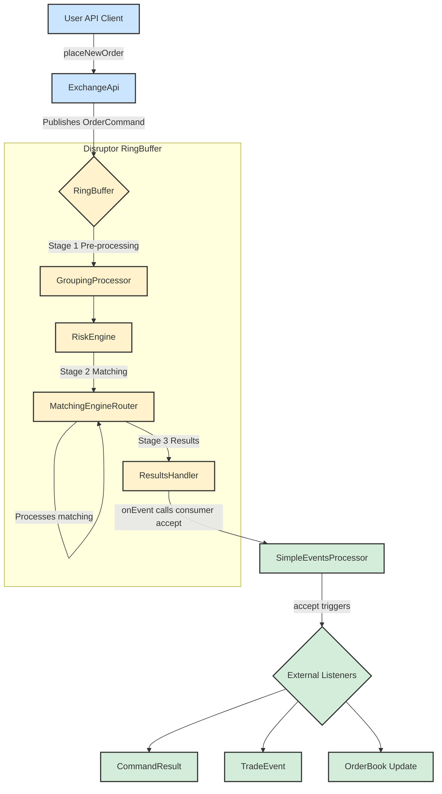

# System Architecture and Order Flow

This document describes the architecture of the exchange core, focusing on the life cycle of an order command.

## Order Flow Diagram

The following diagram illustrates the journey of a command from the API to the final event consumers.

## Component Descriptions

Here is a detailed breakdown of each component's role in the processing pipeline:

### Client
*   **User API Client**: Represents any external application or user script that interacts with the exchange. It initiates actions by sending commands, such as placing or canceling orders.

### Exchange Core (Disruptor RingBuffer)
This is the high-performance, low-latency core of the system, built on the LMAX Disruptor pattern.

*   **ExchangeApi**: The public-facing gateway to the exchange. It provides a user-friendly API and is responsible for translating external calls (e.g., `placeNewOrder`) into the internal `OrderCommand` format. It then publishes these commands onto the `RingBuffer` for processing.

*   **RingBuffer**: The central data structure of the Disruptor framework. It's a pre-allocated circular buffer where `OrderCommand` objects live. All processing stages (processors) operate on the objects directly within this buffer, which enables lock-free, high-throughput communication between components.

*   **GroupingProcessor (Stage 1)**: This is the first processor in the pipeline. Its primary function is to batch incoming commands into groups. This is a performance optimization that improves throughput by reducing the overhead of processing each command individually. Groups are formed based on a configurable size limit or a time-based threshold.

*   **RiskEngine (Stage 1)**: The second processor, responsible for pre-trade risk management and user account state. It's a stateful component that maintains all user profiles, balances, and positions. When it receives a `PLACE_ORDER` command, it checks if the user has sufficient funds or margin to cover the order. It will reject any command that fails these risk checks. It also handles administrative tasks like balance adjustments and user creation.

*   **MatchingEngineRouter (Stage 2)**: The third processor and the heart of the matching logic. It takes commands that have been cleared by the `RiskEngine` and routes them to the appropriate `IOrderBook` instance based on the command's symbol. It executes the core matching algorithm, which results in trades, rejections, or modifications to the order book. The outcomes are attached to the `OrderCommand` as a chain of `MatcherTradeEvent` objects. It is also responsible for generating L2 market data snapshots.

*   **ResultsHandler (Stage 3)**: The final processor in the Disruptor pipeline. Its role is simple but crucial: it takes the fully processed `OrderCommand`—now enriched with a final result code and a chain of matcher events—and passes it to the designated downstream event consumer.

### Event Handling
*   **SimpleEventsProcessor**: This component acts as the primary downstream consumer. It receives the processed `OrderCommand` from the `ResultsHandler` and translates the internal, complex data structures into clean, discrete events suitable for external systems. It "unpacks" the command to produce `CommandResult` (the high-level outcome), `TradeEvent` (detailed trade information), and `OrderBook` (market data updates).

*   **External Listeners**: This represents the final destination for the events generated by the `SimpleEventsProcessor`. These are the client-side applications, databases, UI frontends, or analytics systems that subscribe to the event stream to stay synchronized with the state of the exchange.
