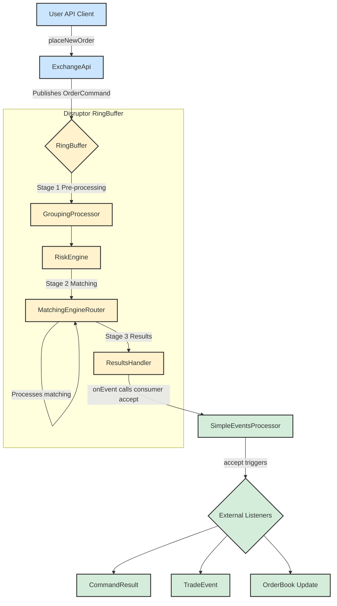

# System Architecture and Order Flow

This document describes the architecture of the exchange core, focusing on the life cycle of an order command.

## Order Flow Diagram

The following diagram illustrates the journey of a command from the API to the final event consumers.

## Component Descriptions

Here is a detailed breakdown of each component's role in the processing pipeline:

### Client
*   **User API Client**: Represents any external application or user script that interacts with the exchange. It initiates actions by sending commands, such as placing or canceling orders.

### [Exchange Core (Disruptor RingBuffer)](https://github.com/C18519898242/exchange-core/blob/master/src/main/java/exchange/core2/core/ExchangeCore.java)
This is the high-performance, low-latency core of the system, built on the LMAX Disruptor pattern. The entire processing pipeline is configured and orchestrated in the `ExchangeCore.java` class.

*   **ExchangeApi**: The public-facing gateway to the exchange. It provides a user-friendly API and is responsible for translating external calls (e.g., `placeNewOrder`) into the internal `OrderCommand` format. It then publishes these commands onto the `RingBuffer` for processing.

*   **RingBuffer**: The central data structure of the Disruptor framework. It's a pre-allocated circular buffer where `OrderCommand` objects live. All processing stages (processors) operate on the objects directly within this buffer, which enables lock-free, high-throughput communication between components.

*   **GroupingProcessor (Stage 1)**: This is the first processor in the pipeline. Its primary function is to batch incoming commands into groups. This is a performance optimization that improves throughput by reducing the overhead of processing each command individually. Groups are formed based on a configurable size limit or a time-based threshold.

*   **RiskEngine (Stage 1)**: The second processor, responsible for pre-trade risk management and user account state. It's a stateful component that maintains all user profiles, balances, and positions. When it receives a `PLACE_ORDER` command, it checks if the user has sufficient funds or margin to cover the order. It will reject any command that fails these risk checks. It also handles administrative tasks like balance adjustments and user creation.

*   **MatchingEngineRouter (Stage 2)**: The third processor and the heart of the matching logic. It takes commands that have been cleared by the `RiskEngine` and routes them to the appropriate `IOrderBook` instance based on the command's symbol. It executes the core matching algorithm, which results in trades, rejections, or modifications to the order book. The outcomes are attached to the `OrderCommand` as a chain of `MatcherTradeEvent` objects. It is also responsible for generating L2 market data snapshots.

*   **ResultsHandler (Stage 3)**: The final processor in the Disruptor pipeline. Its role is simple but crucial: it takes the fully processed `OrderCommand`—now enriched with a final result code and a chain of matcher events—and passes it to the designated downstream event consumer.

### Event Handling
*   **SimpleEventsProcessor**: This component acts as the primary downstream consumer. It receives the processed `OrderCommand` from the `ResultsHandler` and translates the internal, complex data structures into clean, discrete events suitable for external systems. It "unpacks" the command to produce `CommandResult` (the high-level outcome), `TradeEvent` (detailed trade information), and `OrderBook` (market data updates).

*   **External Listeners**: This represents the final destination for the events generated by the `SimpleEventsProcessor`. These are the client-side applications, databases, UI frontends, or analytics systems that subscribe to the event stream to stay synchronized with the state of the exchange.

---

## API Usage: `ExchangeApi` Deep Dive

### English

The `ExchangeApi` class serves as the entry point and facade for the entire trading core. It provides a clear, user-friendly interface for external clients, abstracting away the complexities of the underlying Disruptor framework. Its key responsibilities include:

1.  **API Facade**: It hides the complexity of interacting with the Disruptor `RingBuffer`. Developers call simple methods like `submitCommand(ApiPlaceOrder cmd)` without needing to understand the internal mechanics.
2.  **Command Translation & Publishing**: Its core duty is to translate `ApiCommand` objects into the internal `OrderCommand` format. It uses a predefined `EventTranslator` to copy fields into a pre-allocated `OrderCommand` on the `RingBuffer` and then publishes it, making it visible to the processing pipeline.
3.  **Asynchronous Result Handling**: For async calls, `ExchangeApi` maintains a map of `promises`. It stores a `CompletableFuture` callback against a command's sequence number. When the command is fully processed, the `ResultsHandler` invokes `ExchangeApi.processResult()`, which finds the corresponding callback and completes the future, delivering the result to the original caller.

#### `submitCommandAsync` vs `submitCommandAsyncFullResponse`

The key difference lies in the amount of information returned in the `CompletableFuture`:

*   **`submitCommandAsync`**:
    *   **Returns**: `CompletableFuture<CommandResultCode>`
    *   **Content**: Only the final status code (`SUCCESS`, `RISK_NSF`, etc.).
    *   **Use Case**: Ideal when you only need to know if an operation succeeded or failed, without needing the details of its side effects.

*   **`submitCommandAsyncFullResponse`**:
    *   **Returns**: `CompletableFuture<OrderCommand>`
    *   **Content**: The entire, fully-processed `OrderCommand` object, which includes the `resultCode`, a chain of `MatcherTradeEvent`s (trades), and potentially `L2MarketData`.
    *   **Use Case**: Essential when you need the full details of the operation's outcome, such as the average fill price and trade-by-trade specifics of a market order.

#### Asynchronous Usage Pattern

The standard way to interact with the API asynchronously is:

1.  **Call an `async` method**: `CompletableFuture<OrderCommand> future = exchangeApi.submitCommandAsyncFullResponse(placeOrderCmd);`
2.  **Process the `Future`**:
    *   **Blocking Wait (for tests)**: `OrderCommand result = future.join();`
    *   **Non-Blocking Callback (recommended)**: `future.thenAccept(result -> { /* process result here */ });`

---

### 中文

`ExchangeApi` 类是整个交易核心的入口和门面（Facade）。它为外部客户端提供了一套清晰、易于使用的接口，同时将底层 Disruptor 框架的复杂性抽象出来。其核心职责包括：

1.  **API 门面**: 它封装了与 Disruptor `RingBuffer` 交互的复杂性。开发者只需调用如 `submitCommand(ApiPlaceOrder cmd)` 这样的简单方法，而无需理解内部机制。
2.  **命令翻译与发布**: 它的核心任务是将 `ApiCommand` 对象翻译成内部的 `OrderCommand` 格式。它使用预定义的 `EventTranslator` 将字段复制到 `RingBuffer` 上的一个预分配 `OrderCommand` 对象中，然后发布它，使其对处理流水线可见。
3.  **异步结果处理**: 对于异步调用，`ExchangeApi` 维护一个 `promises` 映射。它根据命令的序列号存储一个 `CompletableFuture` 的回调。当命令处理完毕，`ResultsHandler` 会调用 `ExchangeApi.processResult()`，该方法会找到对应的回调并完成 `Future`，从而将结果传递给原始调用者。

#### `submitCommandAsync` 与 `submitCommandAsyncFullResponse` 的区别

核心区别在于 `CompletableFuture` 返回的信息量：

*   **`submitCommandAsync`**:
    *   **返回**: `CompletableFuture<CommandResultCode>`
    *   **内容**: 仅包含最终的状态码（如 `SUCCESS`, `RISK_NSF` 等）。
    *   **应用场景**: 当您只关心操作是否成功，而不需要其副作用的细节时，这是理想的选择。

*   **`submitCommandAsyncFullResponse`**:
    *   **返回**: `CompletableFuture<OrderCommand>`
    *   **内容**: 整个处理完毕的 `OrderCommand` 对象，包含 `resultCode`、`MatcherTradeEvent` 链（交易明细）以及可能的 `L2MarketData`。
    *   **应用场景**: 当您需要操作结果的全部细节时（例如市价单的平均成交价和每笔成交详情），此方法是必需的。

#### 异步使用模式

与 API 进行异步交互的标准方式是：

1.  **调用 `async` 方法**: `CompletableFuture<OrderCommand> future = exchangeApi.submitCommandAsyncFullResponse(placeOrderCmd);`
2.  **处理 `Future`**:
    *   **阻塞式等待 (用于测试)**: `OrderCommand result = future.join();`
    *   **非阻塞式回调 (推荐)**: `future.thenAccept(result -> { /* 在此处理结果 */ });`

---

## Disruptor Pipeline Orchestration

### English

The `RingBuffer` itself is just a high-performance queue. It does not directly "orchestrate" the stages. The orchestration is defined in `ExchangeCore.java` using a mechanism called a **Dependency Barrier**.

1.  **Concept**: Each processor (like `RiskEngine`) has a `Sequence` counter. A `SequenceBarrier` ensures that a processor cannot process an item from the `RingBuffer` until all of its prerequisite processors (its dependencies) have finished processing that same item.
2.  **Orchestration in `ExchangeCore`**: The constructor of `ExchangeCore` sets up a dependency graph.
    *   It first creates a barrier for Stage 1 processors (`GroupingProcessor`, `RiskEngine`), allowing them to run in parallel.
    *   It then creates a second barrier for the Stage 2 processor (`MatchingEngineRouter`) that waits for *all* Stage 1 processors to complete.
    *   Finally, it creates a third barrier for the Stage 3 processor (`ResultsHandler`) that waits for Stage 2 to complete.
3.  **Workflow**: This setup creates a processing pipeline. An `OrderCommand` is processed by Stage 1, then the barriers ensure it's passed to Stage 2, and finally to Stage 3, in a highly efficient, lock-free manner.

### 中文

`RingBuffer` 本身只是一个高性能队列，它不直接“编排”各个阶段。真正的编排是在 `ExchangeCore.java` 中通过一种叫做**依赖屏障 (Dependency Barrier)** 的机制来定义的。

1.  **核心概念**: 每个处理器（如 `RiskEngine`）都有一个 `Sequence` 计数器。`SequenceBarrier` 确保一个处理器在处理 `RingBuffer` 中的某个数据项之前，其所有前置依赖处理器都已完成对该数据项的处理。
2.  **在 `ExchangeCore` 中编排**: `ExchangeCore` 的构造函数构建了一个依赖关系图。
    *   首先，它为第一阶段的处理器（`GroupingProcessor`, `RiskEngine`）创建一个屏障，允许它们并行运行。
    *   然后，它为第二阶段的处理器（`MatchingEngineRouter`）创建第二个屏障，该屏障会等待**所有**第一阶段的处理器完成工作。
    *   最后，它为第三阶段的处理器（`ResultsHandler`）创建第三个屏障，该屏障等待第二阶段完成。
3.  **工作流程**: 这种设置创建了一个处理流水线。一个 `OrderCommand` 先由第一阶段处理，然后屏障确保它被传递到第二阶段，最后到第三阶段，整个过程高效且无锁。
