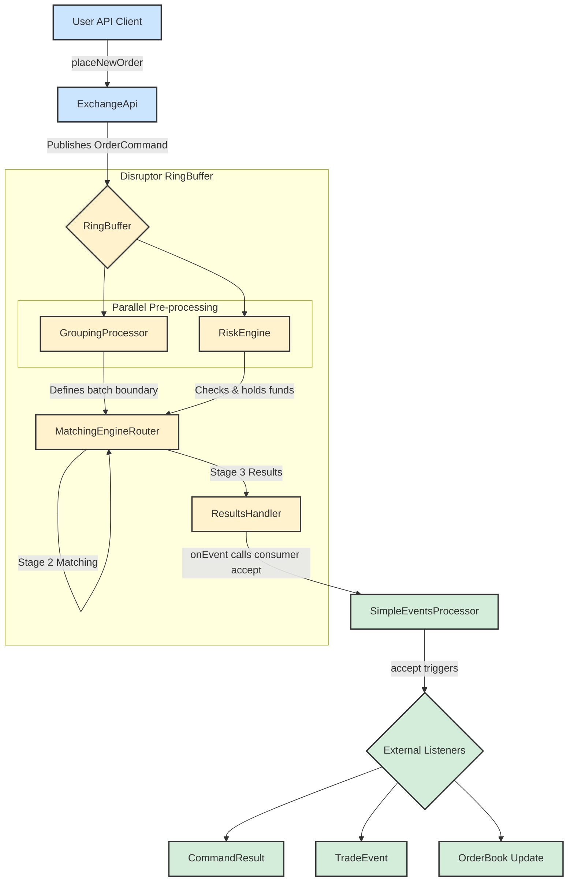

# System Architecture and Order Flow

This document describes the architecture of the exchange core, focusing on the life cycle of an order command.

## Order Flow Diagram

The following diagram illustrates the journey of a command from the API to the final event consumers.



## Component Descriptions

Here is a detailed breakdown of each component's role in the processing pipeline:

### Client
*   **User API Client**: Represents any external application or user script that interacts with the exchange. It initiates actions by sending commands, such as placing or canceling orders.

### [Exchange Core (Disruptor RingBuffer)](https://github.com/C18519898242/exchange-core/blob/master/src/main/java/exchange/core2/core/ExchangeCore.java)
This is the high-performance, low-latency core of the system, built on the LMAX Disruptor pattern. The entire processing pipeline is configured and orchestrated in the `ExchangeCore.java` class.

*   **ExchangeApi**: The public-facing gateway to the exchange. It provides a user-friendly API and is responsible for translating external calls (e.g., `placeNewOrder`) into the internal `OrderCommand` format. It then publishes these commands onto the `RingBuffer` for processing.

*   **RingBuffer**: The central data structure of the Disruptor framework. It's a pre-allocated circular buffer where `OrderCommand` objects live. All processing stages (processors) operate on the objects directly within this buffer, which enables lock-free, high-throughput communication between components.

*   **GroupingProcessor (Stage 1, Parallel)**: As **one of the parallel processors** in Stage 1, its primary function is to batch incoming commands into groups. This is a performance optimization that improves throughput. It is not concerned with the business content of commands but only defines the "batch" boundaries for downstream processors.

*   **RiskEngine (Stage 1, Parallel)**: As the **other parallel processor** in Stage 1, it is responsible for pre-trade risk management and user account state. It is a stateful component that inspects every command within a batch. When it receives a `PLACE_ORDER` command, it checks if the user has sufficient funds or margin to cover the order and rejects any command that fails these checks.

*   **MatchingEngineRouter (Stage 2)**: The **Stage 2** processor and the heart of the matching logic. It must wait for the **same command** to be processed by both `GroupingProcessor` and `RiskEngine` before it can begin. It takes commands that have passed risk checks and routes them to the appropriate `IOrderBook` instance for matching. The outcomes are attached to the `OrderCommand` as a chain of `MatcherTradeEvent` objects.

*   **ResultsHandler (Stage 3)**: The final processor in the Disruptor pipeline. Its role is simple but crucial: it takes the fully processed `OrderCommand`—now enriched with a final result code and a chain of matcher events—and passes it to the designated downstream event consumer.

### Event Handling
*   **SimpleEventsProcessor**: This component acts as the primary downstream consumer. It receives the processed `OrderCommand` from the `ResultsHandler` and translates the internal, complex data structures into clean, discrete events suitable for external systems. It "unpacks" the command to produce `CommandResult` (the high-level outcome), `TradeEvent` (detailed trade information), and `OrderBook` (market data updates).

*   **External Listeners**: This represents the final destination for the events generated by the `SimpleEventsProcessor`. These are the client-side applications, databases, UI frontends, or analytics systems that subscribe to the event stream to stay synchronized with the state of the exchange.

---

## API Usage: `ExchangeApi` Deep Dive

The `ExchangeApi` class serves as the entry point and facade for the entire trading core. It provides a clear, user-friendly interface for external clients, abstracting away the complexities of the underlying Disruptor framework. Its key responsibilities include:

1.  **API Facade**: It hides the complexity of interacting with the Disruptor `RingBuffer`. Developers call simple methods like `submitCommand(ApiPlaceOrder cmd)` without needing to understand the internal mechanics.
2.  **Command Translation & Publishing**: Its core duty is to translate `ApiCommand` objects into the internal `OrderCommand` format. It uses a predefined `EventTranslator` to copy fields into a pre-allocated `OrderCommand` on the `RingBuffer` and then publishes it, making it visible to the processing pipeline.
3.  **Asynchronous Result Handling**: For async calls, `ExchangeApi` maintains a map of `promises`. It stores a `CompletableFuture` callback against a command's sequence number. When the command is fully processed, the `ResultsHandler` invokes `ExchangeApi.processResult()`, which finds the corresponding callback and completes the future, delivering the result to the original caller.

#### `submitCommandAsync` vs `submitCommandAsyncFullResponse`

The key difference lies in the amount of information returned in the `CompletableFuture`:

*   **`submitCommandAsync`**:
    *   **Returns**: `CompletableFuture<CommandResultCode>`
    *   **Content**: Only the final status code (`SUCCESS`, `RISK_NSF`, etc.).
    *   **Use Case**: Ideal when you only need to know if an operation succeeded or failed, without needing the details of its side effects.

*   **`submitCommandAsyncFullResponse`**:
    *   **Returns**: `CompletableFuture<OrderCommand>`
    *   **Content**: The entire, fully-processed `OrderCommand` object, which includes the `resultCode`, a chain of `MatcherTradeEvent`s (trades), and potentially `L2MarketData`.
    *   **Use Case**: Essential when you need the full details of the operation's outcome, such as the average fill price and trade-by-trade specifics of a market order.

#### Asynchronous Usage Pattern

The standard way to interact with the API asynchronously is:

1.  **Call an `async` method**: `CompletableFuture<OrderCommand> future = exchangeApi.submitCommandAsyncFullResponse(placeOrderCmd);`
2.  **Process the `Future`**:
    *   **Blocking Wait (for tests)**: `OrderCommand result = future.join();`
    *   **Non-Blocking Callback (recommended)**: `future.thenAccept(result -> { /* process result here */ });`

---

## Disruptor Pipeline Orchestration

The `RingBuffer` itself is just a high-performance, lock-free circular queue responsible for storing and passing data (in this case, `OrderCommand` objects). **It does not directly "orchestrate" the stages; instead, this is achieved through a mechanism called a "Dependency Barrier."**

This orchestration process is defined in the `ExchangeCore` constructor, which can be thought of as building a "dependency graph." Let's break it down:

1.  **Core Concepts: Sequence and Barrier**
    *   **Sequence**: Each processor has its own `Sequence` object. This acts as a "counter" for the position (sequence number) in the `RingBuffer` that the processor has currently handled.
    *   **SequenceBarrier**: This is a barrier. Before processing the next item, a processor must wait for the `Sequence` of all its prerequisite processors to advance past that item's position. This barrier ensures that a processor does not handle data that has not yet been processed by its dependencies.

2.  **Orchestrating Stages 1, 2, and 3**
    In `ExchangeCore.java`, you will see code like this (this is the standard LMAX Disruptor setup pattern):
    ```java
    // 1. Create an initial barrier from the RingBuffer, which all Stage 1 processors depend on.
    SequenceBarrier barrier1 = ringBuffer.newBarrier();

    // 2. Create Stage 1 processors (Grouping, Risk), both waiting for barrier1.
    //    - GroupingProcessor(barrier1)
    //    - RiskEngine(barrier1)
    //    These two processors can execute in parallel as they have no dependency on each other, only on the raw data from the RingBuffer.

    // 3. Create a Stage 2 barrier that waits for all Stage 1 processors to complete.
    //    This barrier will track the Sequences of GroupingProcessor and RiskEngine.
    SequenceBarrier barrier2 = ringBuffer.newBarrier(
        groupingProcessor.getSequence(), 
        riskEngine.getSequence()
    );

    // 4. Create the Stage 2 processor (MatchingEngine), which waits for barrier2.
    //    - MatchingEngineRouter(barrier2)
    //    This means MatchingEngineRouter must wait until both GroupingProcessor and RiskEngine
    //    have finished processing the same OrderCommand before it can begin.

    // 5. Create a Stage 3 barrier that waits for the Stage 2 processor to complete.
    SequenceBarrier barrier3 = ringBuffer.newBarrier(
        matchingEngineRouter.getSequence()
    );

    // 6. Create the Stage 3 processor (ResultsHandler), which waits for barrier3.
    //    - ResultsHandler(barrier3)
    ```

3.  **Workflow (Example with one `OrderCommand`)**
    *   **Publish**: `ExchangeApi` publishes an `OrderCommand` to sequence number `N` on the `RingBuffer`.
    *   **Stage 1**:
        *   `GroupingProcessor` and `RiskEngine` are both waiting for `barrier1`. Once sequence `N` is available, they can both start processing the command in `RingBuffer[N]`.
        *   After they each finish processing, they update their own `Sequence` to `N`.
    *   **Stage 2**:
        *   `MatchingEngineRouter` waits for `barrier2`. `barrier2` checks the `Sequence` of both `GroupingProcessor` and `RiskEngine`. Only when both sequences have reached or surpassed `N` does `barrier2` give the green light.
        *   Once cleared, `MatchingEngineRouter` processes the command at `RingBuffer[N]`. After completion, it updates its `Sequence` to `N`.
    *   **Stage 3**:
        *   `ResultsHandler` waits for `barrier3`. `barrier3` checks the `Sequence` of `MatchingEngineRouter`. Once it reaches `N`, `barrier3` gives the green light.
        *   `ResultsHandler` begins processing, completing all operations for this command.

**Summary**
The `RingBuffer` is like a physical assembly line conveyor belt, while **orchestration is implemented via the `SequenceBarrier`**. Each `SequenceBarrier` acts like a "checkpoint" on the assembly line, ensuring that a part (`OrderCommand`) can only move to the next station after all previous stations (dependent processors) have completed their work on it.

In this way, Disruptor elegantly defines the dependencies and execution order among processors, achieving an efficient, lock-free, parallel, and serial processing flow.

---

## Component Deep Dive: GroupingProcessor

`GroupingProcessor` is the **first processor** in the Disruptor pipeline and serves as a critical **performance optimization component**. Its core idea is simple: **aggregate individual commands into batches and then pass the entire batch to the next processor.**

This is like ordering at a fast-food restaurant. If the kitchen prepares one burger for every single customer order, it's inefficient. But if the cashier (`GroupingProcessor`) collects orders for 10 consecutive burgers and hands them to the kitchen (`RiskEngine`) all at once, the kitchen can operate like an assembly line, greatly improving efficiency.

Let's delve into its mechanics:

1.  **Objective: Increase Throughput**
    *   In ultra-low-latency systems, the fixed overhead of processing a single event (like method calls, cache misses, etc.) can become significant.
    *   By grouping commands, `GroupingProcessor` "amortizes" the processing cost over multiple commands. Downstream processors (like `RiskEngine`) only need to be woken up once to handle a batch of commands, rather than once for each command. This drastically reduces context switching and inter-processor communication overhead, thereby significantly boosting the system's overall throughput.

2.  **How It Works**
    *   `GroupingProcessor` receives an `OrderCommand` from the `RingBuffer` in its `onEvent` method.
    *   It does **not** immediately pass this command on; instead, it holds onto it.
    *   It checks if the command is a "**trigger signal**." In `exchange-core`, this is typically a `GROUPING_FLUSH_SIGNAL` command or a special `endOfBatch` flag.
    *   When `GroupingProcessor` receives a trigger signal, or the number of held commands reaches a preset threshold (`groupingMaxBatchSize`), or the waiting time exceeds a certain threshold (`groupingMaxBatchDelayNs`), it marks the end of the current batch of accumulated commands and then updates its `Sequence`.
    *   This `Sequence` update triggers the `SequenceBarrier`, letting the downstream `RiskEngine` know: "All commands from the end of the last batch to this point are ready; you can start processing them."

3.  **Batch Boundaries**
    There are two main conditions that trigger a batch "flush", both implemented within the `processEvents()` method of `GroupingProcessor.java`:

    *   **Size Threshold**: While processing events, if the number of accumulated commands in a batch (`msgsInGroup`) reaches the limit (`msgsInGroupLimit`), the processor forces a switch to the next batch.
        ```java
        if (msgsInGroup >= msgsInGroupLimit && cmd.command != OrderCommandType.PERSIST_STATE_RISK) {
            groupCounter++;
            msgsInGroup = 0;
        }
        ```

    *   **Time Threshold**: When there are no new events in the `RingBuffer` and the processor is idle, it checks an internal timer. If the current time has exceeded the maximum waiting time for the batch (`groupLastNs`), it forces the current batch to end, preventing excessive command latency.
        ```java
        } else {
            // Executes when the processor is idle
            final long t = System.nanoTime();
            if (msgsInGroup > 0 && t > groupLastNs) {
                // Switch group if time expired and batch is not empty
                groupCounter++;
                msgsInGroup = 0;
            }
        }
        ```

**Summary**
`GroupingProcessor` is a classic **batch processing** optimization. It sacrifices the **lowest possible latency** for a single command (as it has to wait to be grouped) in exchange for **higher overall system throughput**. In scenarios like financial trading, which require handling a massive volume of concurrent requests, this trade-off is very common and effective. It forms Stage 1 along with `RiskEngine`, preparing batches of pre-processed commands for the subsequent matching stage.

---

## Component Deep Dive: RiskEngine

The `RiskEngine` is the **second gate** in the trading pipeline and the **first true business logic gate**. It is a **stateful** component whose core responsibility is **pre-trade risk checks and account state management**. Think of it as a bank teller who must verify your identity, check if your account is active, and ensure you have sufficient funds before processing a transfer request (placing an order).

Its work is divided into two main parts: **pre-processing (Hold)** and **post-processing (Release)**, corresponding to the `preProcessCommand` and `handlerRiskRelease` methods.

### Command Types Handled by `RiskEngine`

The `RiskEngine` is a **mandatory stop** for almost all commands before they reach the matching engine. It uses a large `switch` statement (in the `preProcessCommand` method) to differentiate and apply logic for various command types:

1.  **`PLACE_ORDER`**: This is the most complex and critical logic.
    *   **Checks**: Verifies the user exists, the symbol is valid, and the order quantity/price are legal.
    *   **Calculation**: Computes the required funds (margin) to hold based on the order's side, price, and quantity.
    *   **Hold**: Transfers the required funds from the user's available balance (`balance`) to the held amount (`heldAmount`).
    *   **Rejection**: If the available balance is insufficient, it immediately sets `resultCode = RISK_NSF` (Not Sufficient Funds) and terminates the command's processing.

2.  **`CANCEL_ORDER`**:
    *   **Checks**: Verifies the order exists and belongs to the user.
    *   **Note**: It does **not** immediately release the held funds. This is because it doesn't know if the order was partially filled at the moment of cancellation. The release of funds must await the final result from the matching engine.

3.  **`MOVE_ORDER`**:
    *   **Checks**: Same as `CANCEL_ORDER`.
    *   **Processing**: It handles the old order like a `CANCEL_ORDER` and the new-priced order like a `PLACE_ORDER`, but this is all at the "pre-processing" level. The actual fund changes depend on the matching result.

4.  **`ADJUST_BALANCE`**:
    *   **Checks**: Verifies the user exists.
    *   **Processing**: Directly modifies the user's `balance`. This is a purely administrative action that does not proceed to the matching engine.

### Core Data Structures

All of `RiskEngine`'s logic revolves around two core, in-memory `Map`s (specifically `LongObjectHashMap` for performance):

1.  **`users` (`LongObjectHashMap<UserProfile>`)**:
    *   **Key**: `uid` (User ID)
    *   **Value**: A `UserProfile` object, containing all information for that user.

2.  **`accounts` (`IntObjectHashMap<UserCurrencyAccount>`)**:
    *   This is a `Map` inside the `UserProfile`.
    *   **Key**: `currency` code
    *   **Value**: A `UserCurrencyAccount` object, which stores the user's financial information for a **specific currency**, including:
        *   `balance`: The total balance.
        *   `heldAmount`: The amount frozen for open orders.
        *   The **available balance** is calculated as `balance - heldAmount`.

### Summary: The Essence of `RiskEngine`

The `RiskEngine` is essentially an **in-memory, high-performance state machine for accounts and positions**.

*   Through its **hold mechanism (`heldAmount`)**, it ensures that a user's funds are safely reserved before an order enters the "black box" of the matching engine.
*   Through its **two-stage processing (`preProcessCommand` and `handlerRiskRelease`)**, it guarantees that no matter the matching outcome (full fill, partial fill, or no fill), the user's final account state remains perfectly consistent with the result.

This design makes the `RiskEngine` the **cornerstone of financial security** for the entire trading system.
