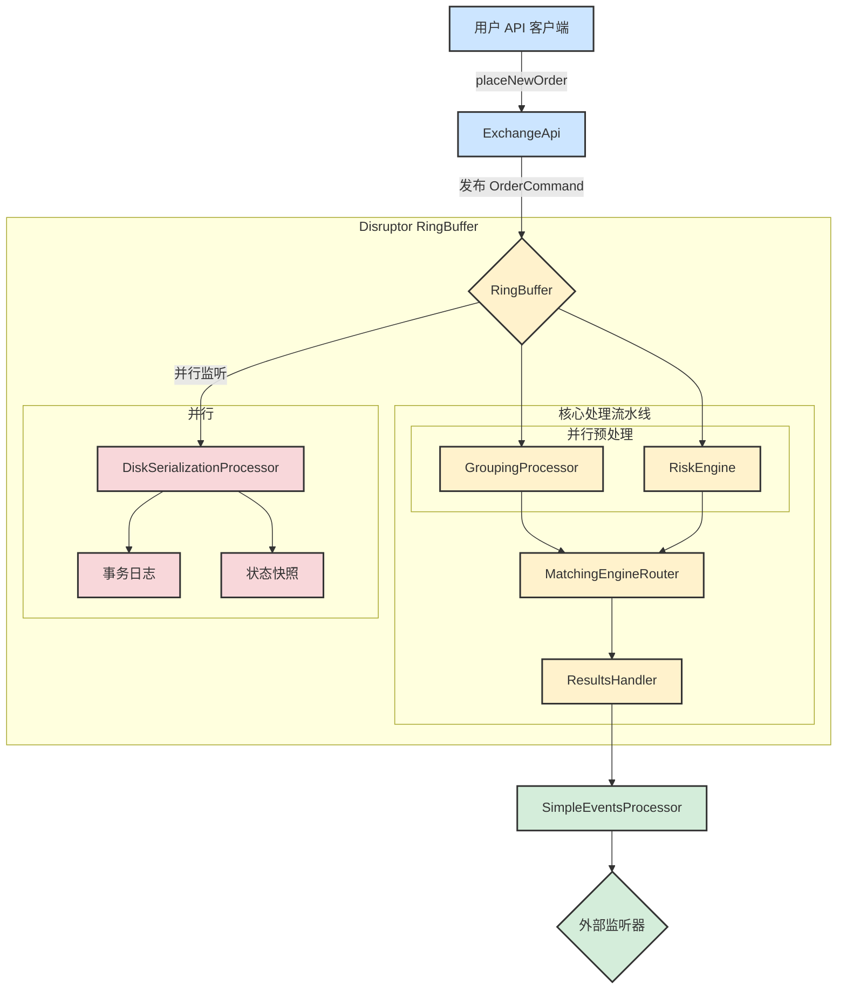

# 系统架构和订单流

本文档描述了交易核心的架构，重点关注订单命令的生命周期。

## 订单流图

下图说明了命令从 API 到最终事件消费者的流转过程，并包含了持久化和恢复机制。




## 组件描述

以下是处理流水线中每个组件角色的详细分解：

<h3 id="component-client">客户端</h3>

*   **用户 API 客户端**: 代表与交易所交互的任何外部应用程序或用户脚本。它通过发送命令（如放置或取消订单）来发起操作。

<h3 id="component-core">交易核心 (Disruptor RingBuffer)</h3>

这是系统的高性能、低延迟核心，基于 LMAX Disruptor 模式构建。整个处理流水线在 `ExchangeCore.java` 类中进行配置和编排。
*   **核心类**: `src/main/java/exchange/core2/core/ExchangeCore.java`

### ExchangeApi

面向公众的交易所网关。它提供了一个用户友好的 API，并负责将外部调用（例如 `placeNewOrder`）转换为内部的 `OrderCommand` 格式。然后，它将这些命令发布到 `RingBuffer` 上进行处理。
*   **关键类位置**: `src/main/java/exchange/core2/core/ExchangeApi.java`

### RingBuffer

Disruptor 框架的核心数据结构。它是一个预先分配的环形缓冲区，`OrderCommand` 对象存活于此。所有处理阶段（处理器）都直接操作此缓冲区中的对象，从而实现了组件之间无锁、高吞t量的通信。

### GroupingProcessor (阶段 1, 并行)

作为阶段1的**并行处理器之一**，其主要功能是将传入的命令分组成批次。这是一种性能优化，通过减少处理每个命令的开销来提高吞吐量。它不关心命令的业务内容，只为下游定义“批次”的边界。
*   **关键类位置**: `src/main/java/exchange/core2/core/processors/GroupingProcessor.java`

### RiskEngine (阶段 1, 并行)

作为阶段1的**另一个并行处理器**，负责交易前风险管理和用户账户状态。它是一个有状态的组件，对批次内的每个命令进行检查。当收到 `PLACE_ORDER` 命令时，它会检查用户是否有足够的资金或保证金来覆盖该订单。它将拒绝任何未通过这些风险检查的命令。
*   **关键类位置**: `src/main/java/exchange/core2/core/processors/RiskEngine.java`

### MatchingEngineRouter (阶段 2)

**第二阶段**的处理器，是撮合逻辑的核心。它必须等待**同一个命令**被 `GroupingProcessor` 和 `RiskEngine` 都处理完毕后才能开始。它接收已通过风险检查的命令，并根据交易对将其路由到相应的 `IOrderBook` 实例执行撮合。结果作为 `MatcherTradeEvent` 对象链附加到 `OrderCommand` 上。
*   **关键类位置**: `src/main/java/exchange/core2/core/processors/MatchingEngineRouter.java`

### ResultsHandler (阶段 3)

Disruptor 流水线中的最后一个处理器。其作用简单但至关重要：它接收完全处理过的 `OrderCommand`——现在已富含最终结果代码和撮合事件链——并将其传递给指定的下游事件消费者。
*   **关键类位置**: `src/main/java/exchange/core2/core/processors/ResultsHandler.java`

<h3 id="component-events">事件处理</h3>

### SimpleEventsProcessor

该组件充当主要的下游消费者。它从 `ResultsHandler` 接收处理过的 `OrderCommand`，并将内部复杂的的数据结构转换为适用于外部系统的干净、离散的事件。它“解包”命令以产生 `CommandResult`（高级别结果）、`TradeEvent`（详细交易信息）和 `OrderBook`（市场数据更新）。
*   **关键类位置**: `src/main/java/exchange/core2/core/SimpleEventsProcessor.java`

### 外部监听器

这代表了 `SimpleEventsProcessor` 生成的事件的最终目的地。这些是订阅事件流以与交易所状态保持同步的客户端应用程序、数据库、UI 前端或分析系统。

<h3 id="component-persistence">持久化与恢复</h3>

### DiskSerializationProcessor

这是一个**并行**的、独立于核心处理流水线的处理器。它的存在是为了保证系统的**持久化**和**灾难恢复**能力，而不会拖慢核心交易的性能。它的工作模式是整个系统可靠性的基石。
*   **关键类位置**: `src/main/java/exchange/core2/core/processors/journaling/DiskSerializationProcessor.java`
    *   **事务日志 (Journaling)**: 它像一个飞行记录仪，监听并序列化每一个会改变系统状态的 `OrderCommand`，并以高效的顺序写方式记录到磁盘上的日志文件中。
    *   **状态快照 (Snapshotting)**: 它负责接收核心业务引擎（`RiskEngine`, `MatchingEngineRouter`）的完整状态，并将其保存为快照文件。
    *   **恢复机制**: 当系统重启时，它能够先加载最新的快照，然后重放快照之后的所有事务日志，从而将系统内存恢复到宕机前的最终状态。

    关于其工作原理、刷盘机制、文件格式以及恢复流程的完整深度解析，请参阅专门的文档：
    *   **[深度解析：交易引擎数据恢复机制](./DATA_RECOVERY (交易引擎数据恢复机制).cn.md)**

---

## API 用法: `ExchangeApi` 深度解析

`ExchangeApi` 类是整个交易核心的入口和门面（Facade）。它为外部客户端提供了一套清晰、易于使用的接口，同时将底层 Disruptor 框架的复杂性抽象出来。其核心职责包括：

1.  **API 门面**: 它封装了与 Disruptor `RingBuffer` 交互的复杂性。开发者只需调用如 `submitCommand(ApiPlaceOrder cmd)` 这样的简单方法，而无需理解内部机制。
2.  **命令翻译与发布**: 它的核心任务是将 `ApiCommand` 对象翻译成内部的 `OrderCommand` 格式。它使用预定义的 `EventTranslator` 将字段复制到 `RingBuffer` 上的一个预分配 `OrderCommand` 对象中，然后发布它，使其对处理流水线可见。
3.  **异步结果处理**: 对于异步调用，`ExchangeApi` 维护一个 `promises` 映射。它根据命令的序列号存储一个 `CompletableFuture` 的回调。当命令处理完毕，`ResultsHandler` 会调用 `ExchangeApi.processResult()`，该方法会找到对应的回调并完成 `Future`，从而将结果传递给原始调用者。

#### `submitCommandAsync` 与 `submitCommandAsyncFullResponse` 的区别

核心区别在于 `CompletableFuture` 返回的信息量：

*   **`submitCommandAsync`**:
    *   **返回**: `CompletableFuture<CommandResultCode>`
    *   **内容**: 仅包含最终的状态码（如 `SUCCESS`, `RISK_NSF` 等）。
    *   **应用场景**: 当您只关心操作是否成功，而不需要其副作用的细节时，这是理想的选择。

*   **`submitCommandAsyncFullResponse`**:
    *   **返回**: `CompletableFuture<OrderCommand>`
    *   **内容**: 整个处理完毕的 `OrderCommand` 对象，包含 `resultCode`、`MatcherTradeEvent` 链（交易明细）以及可能的 `L2MarketData`。
    *   **应用场景**: 当您需要操作结果的全部细节时（例如市价单的平均成交价和每笔成交详情），此方法是必需的。

#### 异步使用模式

与 API 进行异步交互的标准方式是：

1.  **调用 `async` 方法**: `CompletableFuture<OrderCommand> future = exchangeApi.submitCommandAsyncFullResponse(placeOrderCmd);`
2.  **处理 `Future`**:
    *   **阻塞式等待 (用于测试)**: `OrderCommand result = future.join();`
    *   **非阻塞式回调 (推荐)**: `future.thenAccept(result -> { /* 在此处理结果 */ });`

---

## Disruptor 流水线编排

`RingBuffer` 本身只是一个高性能的、无锁的环形队列，它负责存储和传递数据（在这里是 `OrderCommand` 对象）。**它本身并不直接“编排”各个 Stage，而是通过一种叫做“依赖屏障”（Dependency Barrier）的机制来实现的。**

这个编排过程是在 `ExchangeCore` 的构造函数中定义的，我们可以把它想象成一个“依赖关系图”的构建过程。让我们来梳理一下：

1.  **基本概念：Sequence 和 Barrier**
    *   **Sequence**: 每个处理器（Processor）都有一个自己的 `Sequence` 对象。这可以看作是这个处理器当前处理到了 `RingBuffer` 中的哪个位置（序列号）的“计数器”。
    *   **SequenceBarrier**: 这是一个“屏障”。一个处理器在处理下一个数据之前，必须等待它所依赖的所有前置处理器的 `Sequence` 都越过这个数据的位置。这个屏障确保了处理器不会处理尚未被其前置依赖处理过的数据。

2.  **编排 Stage 1, 2, 3 的过程**
    在 `ExchangeCore.java` 中，您会看到类似这样的代码（这是 LMAX Disruptor 的标准设置模式）：
    ```java
    // 1. 从 RingBuffer 创建一个初始屏障，所有第一阶段的处理器都依赖它
    SequenceBarrier barrier1 = ringBuffer.newBarrier();

    // 2. 创建 Stage 1 的处理器 (Grouping, Risk)，它们都等待 barrier1
    //    - GroupingProcessor(barrier1)
    //    - RiskEngine(barrier1)
    //    这两个处理器可以并行执行，因为它们没有相互依赖，只依赖 RingBuffer 的原始数据。

    // 3. 创建 Stage 2 的屏障，它等待 Stage 1 的所有处理器完成
    //    这个屏障会跟踪 GroupingProcessor 和 RiskEngine 的 Sequence
    SequenceBarrier barrier2 = ringBuffer.newBarrier(
        groupingProcessor.getSequence(), 
        riskEngine.getSequence()
    );

    // 4. 创建 Stage 2 的处理器 (MatchingEngine)，它等待 barrier2
    //    - MatchingEngineRouter(barrier2)
    //    这意味着 MatchingEngineRouter 必须等到 GroupingProcessor 和 RiskEngine 
    //    都处理完同一个 OrderCommand 后，才能开始处理它。

    // 5. 创建 Stage 3 的屏障，它等待 Stage 2 的处理器完成
    SequenceBarrier barrier3 = ringBuffer.newBarrier(
        matchingEngineRouter.getSequence()
    );

    // 6. 创建 Stage 3 的处理器 (ResultsHandler)，它等待 barrier3
    //    - ResultsHandler(barrier3)
    ```

3.  **工作流程（以一个 `OrderCommand` 为例）**
    *   **发布**: `ExchangeApi` 将一个 `OrderCommand` 发布到 `RingBuffer` 的序列号 `N`。
    *   **Stage 1**:
        *   `GroupingProcessor` 和 `RiskEngine` 都在等待 `barrier1`。一旦序列号 `N` 可用，它们俩都可以开始处理 `RingBuffer[N]` 里的这个命令。
        *   它们各自完成处理后，会更新自己的 `Sequence` 到 `N`。
    *   **Stage 2**:
        *   `MatchingEngineRouter` 在等待 `barrier2`。`barrier2` 会检查 `GroupingProcessor` 和 `RiskEngine` 的 `Sequence`。只有当这两个 `Sequence` 都达到或超过 `N` 时，`barrier2` 才会放行。
        *   `barrier2` 放行后，`MatchingEngineRouter` 开始处理 `RingBuffer[N]` 的命令。处理完成后，它也更新自己的 `Sequence` 到 `N`。
    *   **Stage 3**:
        *   `ResultsHandler` 在等待 `barrier3`。`barrier3` 检查 `MatchingEngineRouter` 的 `Sequence`。一旦它达到 `N`，`barrier3` 就放行。
        *   `ResultsHandler` 开始处理，并最终完成对这个命令的所有操作。

**总结**
`RingBuffer` 就像一条物理的流水线传送带，而**编排是通过 `SequenceBarrier` 实现的**。每个 `SequenceBarrier` 都像流水线上的一个“检查点”，它确保只有在所有前序工位（依赖的处理器）都完成了对某个零件（`OrderCommand`）的操作后，这个零件才能流转到下一个工位。

通过这种方式，Disruptor 巧妙地定义了处理器之间的依赖关系和执行顺序，实现了高效的、无锁的并行和串行处理流程。

---

## GroupingProcessor 组件深度解析

`GroupingProcessor` 是 Disruptor 流水线中的**第一个处理器**，它是一个非常关键的**性能优化组件**。它的核心思想很简单：**将单个的命令聚合成批次（Batches），然后将整个批次传递给下一个处理器**。

这就像在快餐店点餐，如果每个顾客点一个汉堡，厨师就做一个汉堡，效率会很低。但如果收银员（`GroupingProcessor`）把连续 10 个汉堡的订单收集起来，一次性交给后厨（`RiskEngine`），后厨就可以流水线作业，大大提高效率。

让我们深入了解它的工作机制：

1.  **目的：提升吞吐量 (Throughput)**
    *   在超低延迟的系统中，处理单个事件的固定开销（比如方法调用、缓存未命中等）可能会变得非常显著。
    *   通过将命令分组，`GroupingProcessor` 将多个命令的处理成本“摊销”了。下游的处理器（如 `RiskEngine`）只需要被唤醒一次就可以处理一批命令，而不是每个命令都被唤醒一次。这极大地减少了上下文切换和处理器间的通信开销，从而显著提升了系统的总吞吐量。

2.  **工作原理**
    *   `GroupingProcessor` 在 `onEvent` 方法中接收从 `RingBuffer` 传来的 `OrderCommand`。
    *   它并**不立即**将这个命令传递下去，而是先把它“扣留”下来。
    *   它会检查这个命令是否是一个“**触发信号**”。在 `exchange-core` 中，这个信号通常是 `GROUPING_FLUSH_SIGNAL` 命令，或者是一个特殊的 `endOfBatch` 标志。
    *   当 `GroupingProcessor` 收到一个触发信号，或者它“扣留”的命令数量达到了一个预设的阈值（`groupingMaxBatchSize`），或者等待时间超过了某个阈值（`groupingMaxBatchDelayNs`），它就会把当前积累的所有命令作为一个“批次”的结束，然后更新自己的 `Sequence`。
    *   这个 `Sequence` 的更新会触发 `SequenceBarrier`，从而让下游的 `RiskEngine` 知道：“从上一个批次的结束点到现在这个点，所有的命令都准备好了，你可以开始处理了。”

3.  **分组的边界**
    分组的触发条件主要有两种，它们都在 `GroupingProcessor.java` 的 `processEvents()` 方法中实现：

    *   **数量阈值**: 在处理事件时，如果一个批次内累积的命令数 (`msgsInGroup`) 达到上限 (`msgsInGroupLimit`)，处理器会强制切换到下一个批次。
        ```java
        if (msgsInGroup >= msgsInGroupLimit && cmd.command != OrderCommandType.PERSIST_STATE_RISK) {
            groupCounter++;
            msgsInGroup = 0;
        }
        ```

    *   **时间阈值**: 当 `RingBuffer` 中没有新事件，处理器处于等待状态时，它会检查内部计时器。如果当前时间已超过本批次的最长等待时间 (`groupLastNs`)，它会强制结束当前批次，以避免命令被过度延迟。
        ```java
        } else {
            // 当处理器空闲时执行
            final long t = System.nanoTime();
            if (msgsInGroup > 0 && t > groupLastNs) {
                // 如果等待时间超时且批次不为空，则切换批次
                groupCounter++;
                msgsInGroup = 0;
            }
        }
        ```

**总结**
`GroupingProcessor` 是一个典型的“**批处理**”优化。它牺牲了单个命令的**最低延迟**（因为命令需要等待成组），来换取整个系统**更高的总吞t量**。在金融交易这种需要处理海量并发请求的场景下，这种权衡是非常常见且有效的。它和 `RiskEngine` 一起构成了 Stage 1，为后续的撮合阶段准备好了一批批经过预处理的命令。

---

## RiskEngine 组件深度解析

`RiskEngine` 是交易流水线中的**第二道关卡**，也是**第一道真正的业务逻辑关卡**。它是一个**有状态**的组件，核心职责是**交易前的风险检查和账户状态管理**。可以把它想象成银行柜台，在处理转账请求（下单）之前，必须先验证你的身份、检查账户是否正常、余额是否足够。

它的工作可以分为两个主要部分：**预处理（Hold）** 和 **后处理（Release）**，分别对应 `preProcessCommand` 和 `handlerRiskRelease` 两个方法。

### `RiskEngine` 处理的命令类型

`RiskEngine` 几乎是所有命令进入撮合引擎前的**必经之路**。它通过一个巨大的 `switch` 语句（在 `preProcessCommand` 方法中）来区分不同的命令类型并执行相应的逻辑：

1.  **`PLACE_ORDER` (下单)**: 这是最复杂、最核心的逻辑。
    *   **检查**: 用户是否存在、品种是否有效、订单数量和价格是否合法。
    *   **计算**: 根据买卖方向、价格和数量，计算需要冻结的资金（保证金）。
    *   **冻结**: 从用户账户的可用余额 (`balance`) 中，将所需资金转移到持有余额 (`heldAmount`)。
    *   **拒绝**: 如果可用余额不足，直接设置 `resultCode = RISK_NSF` (Not Sufficient Funds)，命令处理终止。

2.  **`CANCEL_ORDER` (取消订单)**:
    *   **检查**: 订单是否存在、是否属于该用户。
    *   **注意**: 此时**不会**立即解冻资金。因为它不知道这个订单在被取消的瞬间是否已经部分成交。资金的解冻必须等待撮合引擎的最终结果。

3.  **`MOVE_ORDER` (移动订单)**:
    *   **检查**: 同`CANCEL_ORDER`。
    *   **处理**: 它会先像`CANCEL_ORDER`一样处理旧订单，然后再像`PLACE_ORDER`一样处理新价格的订单，但这一切都是在“预处理”层面，真实的资金变化要等撮合结果。

4.  **`ADJUST_BALANCE` (调整余额)**:
    *   **检查**: 用户是否存在。
    *   **处理**: 直接修改用户的 `balance`。这是一个纯管理操作，不会进入撮合引擎。

#### 关于“按数量市价买入”的特别说明

`RiskEngine` 的设计严格区分了“按金额”和“按数量”的市价单。为了深入理解“按数量市价买入”这一复杂功能的挑战、设计权衡及最终确定的最佳实践方案，请参阅专门的深度解析文档：

*   **[深度解析：市价单按数量买入的设计与实现](./DEEP_DIVE_MARKET_BUY_BY_QUANTITY.cn.md)**

### 核心数据结构

`RiskEngine` 的所有逻辑都围绕着两个核心的、存储在内存中的 `Map` (具体实现是 `LongObjectHashMap`，为了性能) 来展开：

1.  **`users` (`LongObjectHashMap<UserProfile>`)**:
    *   **Key**: `uid` (用户ID)
    *   **Value**: `UserProfile` 对象，包含了该用户的所有信息。

2.  **`accounts` (`IntObjectHashMap<UserCurrencyAccount>`)**:
    *   这是 `UserProfile` 内部的一个 `Map`。
    *   **Key**: `currency` (币种代码)
    *   **Value**: `UserCurrencyAccount` 对象，存储了用户在**某个特定币种**下的所有资金信息，包括：
        *   `balance`: 总余额
        *   `heldAmount`: 因挂单而被冻结的金额
        *   **可用余额**的计算公式就是 `balance - heldAmount`。

### 风险验证失败（“短路”机制）

当 `RiskEngine` 验证失败时，会发生一个**“短路”（Short-circuit）**操作，这是交易系统非常重要的一个性能和安全特性。

具体流程如下：

1.  **设置拒绝码**: 在 `preProcessCommand` 方法中，如果一个 `PLACE_ORDER` 命令因为任何原因验证失败（最常见的是余额不足，即 NSF - Not Sufficient Funds），`RiskEngine` 会立即将该 `OrderCommand` 对象的 `resultCode` 设置为一个明确的失败代码，例如 `RISK_NSF`。

2.  **跳过撮合**: `MatchingEngineRouter`（撮合引擎）收到这个命令后，会检查其 `resultCode`。当它发现命令已被标记为失败时，它会**完全跳过**对这个命令的所有撮合逻辑，直接“原样”将其传递给下一个阶段。

3.  **保证流程完整性**: 即使命令被拒绝，它**仍然会走完整个流水线**，而不会从中途消失。这保证了 Disruptor 的 `Sequence` 机制不会被打乱，所有处理器都能正确地协同工作。

4.  **明确的失败反馈**: 最终，`ResultsHandler` 会将这个带有失败代码的命令传递出去，客户端会收到一个精确的失败原因（例如“余额不足”），而不是一个模糊的“处理失败”。

这个“短路”机制是高性能系统中一个非常优雅的设计，它既能快速拒绝无效操作，又不会破坏整个处理流水线的完整性和一致性。

### 总结：`RiskEngine` 的本质

`RiskEngine` 的本质是一个**基于内存的、高性能的账户和头寸状态机**。

*   它通过**持有锁（`heldAmount`）**机制，确保了在订单进入撮合引擎这个“黑盒”之前，用户的资金已经被安全地预留出来。
*   它通过**两阶段处理（`preProcessCommand` 和 `handlerRiskRelease`）**，保证了无论撮合结果如何（完全成交、部分成交、未成交），用户的最终账户状态都能和撮合结果保持绝对一致。

这种设计使得 `RiskEngine` 成为整个交易系统的**资金安全基石**。

---

## MatchingEngineRouter 组件深度解析

`MatchingEngineRouter` 是 Disruptor 流水线中的**第三道关卡**，也是整个交易系统的“心脏”，负责执行最核心的**订单撮合**功能。

如果说 `RiskEngine` 是“管钱的”，那么 `MatchingEngineRouter` 就是“管交易的”。它的职责听起来很简单，但实现起来非常精妙。

### 核心职责：路由与撮合

`MatchingEngineRouter` 的名字里包含了它的两个核心职责：

1.  **Router (路由器)**:
    *   系统里可能同时存在成百上千个交易对（BTC/USDT, ETH/USDT, ...）。每一个交易对都有一个自己独立的**订单簿 (Order Book)**。
    *   `MatchingEngineRouter` 的首要任务，就是根据订单命令 (`OrderCommand`) 中的 `symbolId`（交易对ID），像一个交通警察一样，把这个订单**派发**给正确的订单簿去处理。
    *   它内部维护了一个 `Map`，`key` 是 `symbolId`，`value` 就是对应交易对的 `IOrderBook` 实例。

2.  **Matching Engine (撮合引擎)**:
    *   当订单被派发到具体的 `IOrderBook` 实例后，真正的撮合逻辑就开始了。
    *   `IOrderBook` 是一个数据结构，它维护了该交易对所有未成交的买单和卖单，并按价格优先、时间优先的原则排序。
    *   **撮合过程**:
        *   **新订单是买单？**: 就去订单簿里找价格最低的卖单。如果新订单的出价 >= 最低卖价，成交！然后继续找下一个最低卖价的卖单，直到订单完全成交，或者再也找不到价格合适的对手单。
        *   **新订单是卖单？**: 就去订单簿里找价格最高的买单。如果新订单的要价 <= 最高买价，成交！然后继续找下一个最高买价的买单。
        *   **如果找不到对手单？**: 那么这个新订单就会被留在订单簿里，成为新的挂单 (Maker Order)，等待别人来和它成交。

### `MatchingEngineRouter` 的关键交互

1.  **接收输入**:
    *   它从 `RiskEngine` 和 `GroupingProcessor` 接收已经通过了“风险检查”和“批次划分”的 `OrderCommand`。
    *   **重要**: 它必须等待**同一个** `OrderCommand` 被前两个处理器都处理完毕后才能开始工作，这是由 Disruptor 的 `SequenceBarrier` 保证的。

2.  **处理逻辑**:
    *   **检查“短路”信号**: 在做任何事情之前，它会先检查 `OrderCommand` 的 `resultCode`。如果 `RiskEngine` 已经把这个订单标记为失败（比如 `RISK_NSF`），`MatchingEngineRouter` 会**完全跳过**所有撮合逻辑，直接把这个失败的命令原样传递下去。
    *   **执行撮合**: 对于合法的订单，它会调用相应 `IOrderBook` 的 `match(OrderCommand)` 方法。
    *   **记录结果**: `IOrderBook` 在撮合过程中，会产生一系列的**交易事件 (`MatcherTradeEvent`)**。这些事件详细记录了每一笔撮合的细节（成交了谁的订单、成交价格、成交数量等）。`MatchingEngineRouter` 会把这些事件像链表一样串起来，挂在 `OrderCommand` 上。

3.  **产生输出**:
    *   处理完成后，`MatchingEngineRouter` 会将这个被“丰富”了的 `OrderCommand`（现在它包含了撮合结果）传递给流水线的下一个、也是最后一个阶段：`ResultsHandler`。

### 订单簿 (`IOrderBook`) 的实现

`exchange-core` 提供了两种 `IOrderBook` 的实现，它们在设计哲学和性能表现上有着天壤之别。为了深入理解这两种实现的内部工作原理、数据结构和性能权衡，请参阅专门的深度解析文档：

*   **[深度解析：订单簿 (Order Book) 的两种实现](./DEEP_DIVE_ORDERBOOK.cn.md)**

简单来说：
*   **`OrderBookNaiveImpl`**: 使用标准 `TreeMap`，易于理解，适合入门和测试。
*   **`OrderBookDirectImpl`**: 使用自定义的链表和基数树，并配合对象池技术，为极致性能而生，是生产环境的首选。

### 总结

`MatchingEngineRouter` 是连接**风险控制**和**交易执行**的核心枢纽。

*   它扮演着**分发者**的角色，确保每个订单都能找到自己的战场（订单簿）。
*   它驱动着**执行者** (`IOrderBook`)，完成最核心的价值交换（订单撮合）。
*   它还是一个**记录员**，把撮合的每一个细节都清晰地记录在 `MatcherTradeEvent` 中，为下游的清算和结算提供不可篡改的依据。

它的设计体现了单一职责原则：它只关心“撮合”这一件事，并把它做到极致。它不关心用户余额（这是 `RiskEngine` 的事），也不关心最终结果如何通知用户（这是 `ResultsHandler` 的事）。

---

## ResultsHandler (结果处理器) - 阶段 3 深度解析

`ResultsHandler` 是整个撮合流程的 **最后一个环节**。它的核心职责非常明确：**将处理完成的命令结果和市场事件，从Disruptor环形缓冲区（Ring Buffer）中取出，并传递给外部世界**。

您可以把它理解为撮合引擎的“出口”或“扬声器”。所有内部处理（风险检查、撮合、资金结算）都已完成，`ResultsHandler` 负责将最终结果发布出去。

### 1. 核心功能

`ResultsHandler` 的核心功能由 `onEvent` 方法实现。这个方法主要做两件事：

1.  **处理分组控制命令 (`GROUPING_CONTROL`)**:
    *   这是一个特殊的内部命令，用于控制 `ResultsHandler` 是否应该处理事件。
    *   如果收到的命令是 `GROUPING_CONTROL`，它会检查 `orderId` 字段来开启或关闭事件处理。
    *   这个机制主要用于 **撮合引擎的批量处理和两阶段处理模式**。在某些场景下，系统需要先将一批相关的命令（例如，一个IOC订单和它引发的所有成交事件）全部处理完毕，然后再统一对外发布结果，以保证外部观察到的一致性。`GROUPING_CONTROL` 就是用来标记这批命令的“开始”和“结束”的。

2.  **消费最终结果 (`resultsConsumer.accept`)**:
    *   如果事件处理是开启状态，`ResultsHandler` 就会调用 `resultsConsumer`。
    *   `resultsConsumer` 是一个通过构造函数注入的 **消费者函数**。这个函数才是真正处理结果的地方。
    *   在 `ExchangeCore` 的实现中，这个 `resultsConsumer` 通常就是 `DisruptorExceptionHandler`，它会将处理结果（成功或失败代码）、市场事件（成交、拒绝、撤单）等信息，通过 `CompletableFuture` 返回给最初调用API的客户端，或者通过 `IEventsHandler` 接口推送给行情订阅者。

### 2. 在整个流程中的位置

`ResultsHandler` 位于处理流程的终点。当命令流经所有前面的阶段（分组、风控、撮合）后，最终到达 `ResultsHandler`。此时，`OrderCommand` 对象已经包含了所有处理结果。`ResultsHandler` 将这个完整的 `OrderCommand` 对象传递给 `resultsConsumer`，由它来通知API调用者并广播市场行情。

### 3. 总结

`ResultsHandler` 是撮合流程的终点，其作用可以概括为：

1.  **最终出口**: 它是所有命令处理结果和市场事件离开Disruptor环形缓冲区的唯一通道。
2.  **流量控制**: 通过 `GROUPING_CONTROL` 命令，它可以实现对事件发布的精细控制，支持批量和原子性的结果发布。
3.  **解耦**: 它将“如何处理结果”的逻辑（`resultsConsumer`）与处理流程本身解耦。`ResultsHandler` 只负责“何时”和“是否”发布，而 `resultsConsumer` 负责“如何”发布。

---

## SimpleEventsProcessor 组件深度解析

`SimpleEventsProcessor` 是连接**核心处理逻辑**和**外部世界**的桥梁。它的角色非常重要：**它是一个翻译器和分发器**。

在 `ResultsHandler` 将处理完毕的 `OrderCommand` 交给它之后，`SimpleEventsProcessor` 的核心任务就是将这个内部的、复杂的、包含了所有处理痕迹的 `OrderCommand` 对象，**翻译**成外部世界可以理解的、干净的、离散的事件，然后**分发**出去。

### 核心入口：`accept` 方法

`SimpleEventsProcessor` 实现了 `ObjLongConsumer<OrderCommand>` 接口，所以它的入口方法是 `accept(OrderCommand cmd, long seq)`。这个方法是所有逻辑的起点，它按顺序做了三件大事：

1.  `sendCommandResult(cmd, seq)`: **发送命令处理结果**
2.  `sendTradeEvents(cmd)`: **发送交易相关事件**
3.  `sendMarketData(cmd)`: **发送行情数据**

下面我们来逐一分解这三个核心方法。

### 1. `sendCommandResult`: 翻译并发送“命令最终结果”

这个方法的目标是告诉API调用者：“你之前提交的那个命令，我已经处理完了，结果是……”。

*   **工作原理**:
    1.  它使用一个 `switch` 语句来判断原始命令的类型（`PLACE_ORDER`, `CANCEL_ORDER` 等）。
    2.  根据命令类型，它会**重新创建一个**原始的 `ApiCommand` 对象（比如 `ApiPlaceOrder`）。这么做是为了将内部复杂的 `OrderCommand` 还原成API层面那个干净的、只包含请求参数的命令对象。
    3.  然后，它将这个新创建的 `ApiCommand`、最终的 `resultCode`（成功、失败、原因码）以及序列号 `seq` 封装成一个 `IEventsHandler.ApiCommandResult` 对象。
    4.  最后，调用 `eventsHandler.commandResult(...)` 将这个结果对象发送出去。`ExchangeApi` 会监听这个事件，并根据 `seq` 找到对应的 `CompletableFuture`，从而让异步调用者收到结果。

*   **核心作用**: **解耦**。它将内部处理的高度优化的数据结构 (`OrderCommand`) 与外部API的清晰数据结构 (`ApiCommand`) 分离开，让外部调用者无需关心内部实现的复杂性。

### 2. `sendTradeEvents`: 翻译并发送“撮合事件”

这是最复杂的部分。`MatchingEngine` 在撮合过程中会产生一系列 `MatcherTradeEvent`，它们像一个链表一样挂在 `OrderCommand` 上。`sendTradeEvents` 的任务就是解析这个链表，并将其翻译成两种独立的、对外的事件：`TradeEvent` 和 `ReduceEvent`。

*   **处理 `REDUCE` 事件**:
    *   如果 `MatcherTradeEvent` 的类型是 `REDUCE`（通常由 `REDUCE_ORDER` 命令产生，表示订单被缩减），它会直接创建一个 `IEventsHandler.ReduceEvent` 并发送。这是一个比较简单的路径。

*   **处理 `TRADE` 和 `REJECT` 事件**:
    *   这是更常见的路径。方法会遍历 `MatcherTradeEvent` 链表。
    *   **`TRADE` 事件**: 如果事件类型是 `TRADE`，它会将其信息（成交的对手方订单ID、成交价格、数量等）提取出来，创建一个 `IEventsHandler.Trade` 对象，并把它添加到一个临时的 `trades` 列表中。
    *   **`REJECT` 事件**: 如果事件类型是 `REJECT`（例如，GTC订单在撮合后剩余部分无法挂单而被拒绝），它会创建一个 `IEventsHandler.RejectEvent`。
    *   **打包发送**: 遍历完成后：
        *   如果 `trades` 列表不为空，它会将所有 `Trade` 对象打包成一个总的 `IEventsHandler.TradeEvent`。这个总事件包含了Taker订单的ID、总成交量、是否已完全成交等宏观信息，以及一个包含所有具体成交明细的 `trades` 列表。然后通过 `eventsHandler.tradeEvent(...)` 发送。
        *   如果之前遇到了 `RejectEvent`，也会通过 `eventsHandler.rejectEvent(...)` 单独发送。

*   **核心作用**: **结构化和聚合**。它将撮合引擎产生的原始、线性的事件流，聚合成结构化的、对业务更有意义的事件。例如，外部系统一次性就能收到一个市价单引发的所有成交记录，而不需要自己去拼接。

### 3. `sendMarketData`: 翻译并发送“订单簿行情”

如果一个命令的执行（如下单、撤单、成交）导致了订单簿的变化，`MatchingEngine` 会将最新的L2市场数据快照（`L2MarketData`）附加到 `OrderCommand` 上。`sendMarketData` 的职责就是处理这个快照。

*   **工作原理**:
    1.  它检查 `cmd.marketData` 是否为空。
    2.  如果不为空，它会遍历 `marketData` 中的 `ask` 和 `bid` 数组（这些是为性能优化的原始数组）。
    3.  对于每一档价格，它会创建一个更易于使用的 `IEventsHandler.OrderBookRecord` 对象（包含价格、该价格的总量、订单数量）。
    4.  最后，它将所有的 `ask` 和 `bid` 记录打包成一个 `IEventsHandler.OrderBook` 对象，并通过 `eventsHandler.orderBook(...)` 发送出去。

*   **核心作用**: **格式化**。它将内部为极致性能设计的、基于原始数组的L2数据，转换成外部系统（如UI界面、行情机器人）更易于消费的、基于对象的列表格式。

### 总结

`SimpleEventsProcessor` 是连接**核心处理逻辑**和**外部世界**的桥梁。它的存在使得：

*   **核心可以专注于性能**: 内部可以使用各种高度优化的、非面向对象的数据结构。
*   **外部可以保持简洁**: 外部系统收到的事件是干净、独立、易于理解的。

它就像一个新闻发言人，将战场上（`MatchingEngine`）传来的复杂、混乱的原始战报，整理成条理清晰的新闻稿（`ApiCommandResult`）、专题报道（`TradeEvent`）和数据图表（`OrderBook`），再发布给全世界的记者（外部监听器）。

---

## 附录：使用 Chronicle Queue 实现可靠事件分发

在 `exchange-core` 与外部网关（如 gRPC 服务、WebSocket 服务）对接时，一个核心挑战是如何可靠地分发核心引擎产生的事件流（如成交回报、行情更新），并支持外部客户端在断线后能从上一次的位置继续订阅，而不会丢失消息。

传统的解决方案面临以下问题：
*   **外部消息队列 (如 Kafka, RabbitMQ)**: 引入了重量级的外部服务依赖，增加了系统复杂性和潜在的延迟，违背了交易核心轻量、内聚的设计原则。
*   **纯内存队列 (如 ArrayBlockingQueue)**: 无法持久化，在服务重启后事件会丢失。更严重的是，如果客户端消费速度跟不上产生速度，会导致队列无限增长，最终引发内存溢出 (OOM)。

为了解决这一问题，我们推荐采用一种高性能、持久化的本地事件日志方案，其最佳实现是使用 **`Chronicle Queue`** 这个类库。

### Chronicle Queue 是什么？

`Chronicle Queue` 是一个**高性能 Java 类库**，它提供了一个持久化的、低延迟的队列实现。它不是一个独立的服务，而是作为 `.jar` 包被集成到应用程序中，运行在同一个 JVM 进程内。

其核心技术是**内存映射文件 (Memory-Mapped Files)**。它将队列数据直接写入操作系统的页缓存 (Page Cache)，实现了接近内存的写入速度和磁盘的持久性与容量。

### 核心优势

1.  **无外部依赖**: 作为一个类库，它不引入任何独立的外部服务，保持了系统的简洁性。
2.  **无内存溢出风险**: 事件数据主要存储在磁盘上，JVM 堆内存占用极小且稳定，从根本上解决了内存队列的 OOM 风险。
3.  **极高性能**: 读写操作在微秒级别，因为它们直接在内存（页缓存）中进行，不会被磁盘 I/O 阻塞。
4.  **自动持久化**: 所有写入队列的数据都会被持久化到磁盘，确保了在应用重启或崩溃后事件不会丢失。
5.  **强大的序号与恢复机制**:
    *   `Chronicle Queue` 使用一个巧妙的、包含时间周期和序列号的复合 `index` (long 类型)。
    *   这使得客户端可以根据一个具体的 `index`，极速地定位到历史数据流中的任意一个点。
    *   当外部客户端（如 gRPC 订阅者）断线重连时，只需提供它收到的最后一个消息的 `index`，服务端就可以从该点的下一条消息开始，无缝地继续推送事件流。

通过在网关层引入 `Chronicle Queue` 作为 `SimpleEventsProcessor` 事件的后端存储，我们可以构建一个既高性能又极其可靠的事件分发系统，完美支持外部客户端的持久化订阅和断线续传功能。

---

## 外部网关接口 (gRPC)

上述架构详细描述了 `exchange-core` 的内部工作机制，其 `ExchangeApi` 提供的是一个高性能的**进程内 Java API**。为了将交易核心的能力暴露给外部的、跨语言的客户端（如 Python 脚本、Web 前端、其他微服务），我们需要一个现代化的网络接口层。

为此，我们设计并实现了一个基于 **gRPC** 的网关集群。该网关集群遵循“职责分离”原则，将不同的功能拆分到独立的网关服务中，以实现最高的性能、安全性和可维护性。

其核心设计思想包括：
*   **按职责分离**: 将功能划分为 `OrderGateway` (私有交易)、`AdminGateway` (内部管理)、`MarketDataGateway` (公开行情) 等多个独立的网关服务。
*   **可靠事件流**: 每个对外提供数据流的网关，都由一个独立的、基于 `Chronicle Queue` 的持久化队列驱动，以实现可靠的、可恢复的事件推送。
*   **有状态会话**: 采用基于用户名/密码的“连接即会话”认证模型，简化客户端实现的同时，通过“单点登录”策略保证账户安全。

关于网关集群的完整架构图、组件详细说明、认证流程、事件流模型以及密码存储策略等所有技术细节，请参阅专门的网关架构文档：
*   **[网关架构设计 (V4 - Final)](./GATEWAY_ARCHITECTURE.cn.md)**
