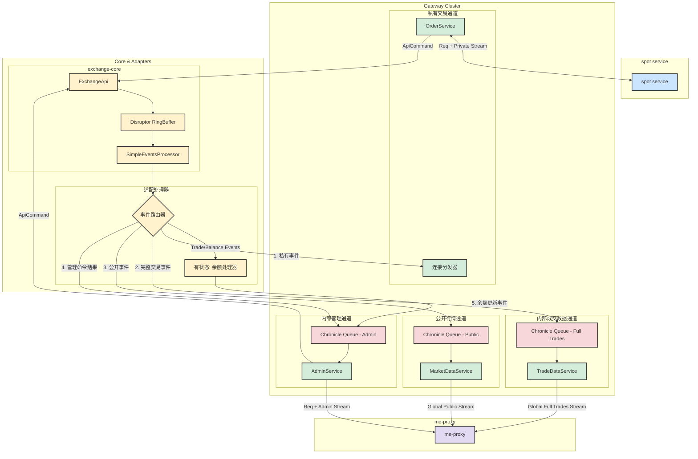

# 网关架构设计 (V4 - Final)

本文档详细描述了基于 gRPC 的、按功能和数据隐私级别分离的网关架构。该架构旨在为 `exchange-core` 提供一个高性能、高可靠、职责清晰、安全合规的现代化接口。

## 1. 核心设计原则

*   **职责与数据分离**: 将不同性质的服务（私有交易、内部数据、公开行情、后台管理）物理隔离到不同的端口/服务中。
*   **统一事件流**: 每个网关的下游都对应一个独立的、持久化的事件队列，保证了消息的严格有序和可靠的断线续传。
*   **有状态的适配处理器**: 引入 `余额处理器` 等有状态的中间件，将核心引擎产生的底层事件，适配成上层应用更易于消费的、包含状态的事件。
*   **数据分级**: 根据目标受众（外部客户、内部服务）对数据进行脱敏处理。

## 2. 整体架构图

## 3. 组件详细说明

### 3.1. `OrderGateway` (私有交易通道)
*   **职责**: 为 spot service 提供交易执行和私有事件通知。
*   **模式**: 每个连接都是一个独立的会话。客户端通过一个 gRPC 连接，既可以发送请求，也可以在流上接收私有回报。

### 3.2. `AdminGateway` (内部管理通道)
*   **职责**: 为 me-proxy (及其他内部管理员) 提供账户管理和状态查询功能。
*   **模式**: 统一事件流模式。
    *   **上游**: 管理员通过 me-proxy 发送请求（如 `adjustBalance`）。
    *   **下游**: 在同一个流上，顺序接收到 `CommandResult` (命令的直接结果) 和 `BalanceUpdateEvent` (包含最新余额的状态更新)。
*   **核心组件**:
    *   `Chronicle Queue - Admin`: 一个专用的、持久化的队列，存储所有需要推送给管理员的事件，保证严格有序。

### 3.3. `TradeDataGateway` (内部成交数据通道)
*   **职责**: 向 me-proxy (及其他内部服务) 提供**完整、未脱敏**的全局成交数据流。

### 3.4. `MarketDataGateway` (公开行情通道)
*   **职责**: 向 me-proxy 提供公开的行情数据流，再由 me-proxy 转发给 spot service。
*   **数据**: 包含 L2 订单簿更新和**已脱敏**的全局成交记录。

### 3.5. 核心适配层

#### `事件路由器` (EventRouter)
这是整个下游设计的核心，它紧跟在 `SimpleEventsProcessor` 之后。
*   **职责**: 检查每一个从核心引擎产生的事件，并将其无状态地分发到多个下游。

#### `余额处理器` (Balance Processor)
*   这是一个**有状态的**服务组件，是实现 `AdminGateway` 良好体验的关键。
*   **职责**: 监听事件，计算并生成包含最新全量余额的 `BalanceUpdateEvent` 事件，并写入 `AdminEvents` 队列。

## 4. 技术实现细节

### 4.1. 通信协议与序列化
*   **RPC 框架**: **gRPC**。基于 HTTP/2，提供高性能、强类型契约、原生跨语言支持和双向流能力，是构建高性能金融服务的理想选择。
*   **数据序列化**: **Protocol Buffers (Protobuf)**。所有网络传输和写入队列的数据统一使用 Protobuf 格式。其优势在于：
    1.  **健壮性与演进**: 优秀的向前/向后兼容性，允许API在不破坏客户端的情况下迭代。
    2.  **性能**: 二进制格式，高效且紧凑。
    3.  **契约即代码**: `.proto` 文件是所有语言实现的统一真理来源。

### 4.2. 认证与授权
*   **决策**: 采用**有状态会话 (Stateful Session)**模式，将认证状态与 gRPC 连接生命周期直接绑定。
*   **凭证**: 客户端使用**用户名 (username)** 和 **密码 (password)** 进行认证。
*   **工作流程**:
    1.  客户端与网关建立一个 gRPC 长连接。
    2.  在此连接上，客户端发送的**第一条消息必须是 `LoginRequest`**，其中包含用户名和密码。
    3.  服务器验证凭证。若成功，则在内存中创建一个会话对象，并将该**连接实例**与对应的 `userId` 进行绑定。
    4.  该连接上的所有后续业务请求（如下单），**无需再携带任何身份信息**。服务器通过连接实例即可识别用户身份。
    5.  当连接断开时，服务器销毁对应的会话。
*   **单点登录**: 系统支持单点登录。如果一个已登录的账户从新的客户端发起登录并验证通过，服务器会主动断开旧的连接，确保同一时间一个账户只有一个活跃会话。
*   **扩展性考量**: 此方案在单实例部署下非常简洁高效。未来若需扩展至多网关实例，需要引入**粘性会话 (Sticky Sessions)**或**分布式会话存储 (如 Redis)**来解决会话同步问题。

### 4.3. 可靠事件流与断线续传
*   **决策**: 将 **Chronicle Queue** 与**事件分发器**结合，为每个对外提供流式数据的网关（`AdminGateway`, `MarketDataGateway` 等）实现真正可靠的事件流。
*   **工作流程**:
    1.  `事件路由器` 或 `余额处理器` 将需要推送的事件，通过 Protobuf 序列化后，**追加写入对应的 Chronicle Queue**。
    2.  当客户端发起订阅请求时（无论是首次还是断线重连），它必须在请求中携带它已收到的**最后一条消息的 `index` (序号)**。
    3.  服务端为该订阅创建一个 Chronicle Queue 的**读取器 (`ExcerptTailer`)**，并移动到客户端指定的 `index`。
    4.  从此位置开始顺序读取并推送消息。
*   **理由**: 此方案保证了即使网关服务重启，事件也不会丢失。客户端可以随时断开，并在重新连接后从上次中断的地方继续，保证了消息的**不重、不漏、有序**。

## 5. 后续实施步骤

1.  **项目结构**: 创建一个新的 Maven 模块 `gateway` 用于存放所有网关相关代码。
2.  **依赖管理**: 在 `pom.xml` 中添加 `grpc-java` (netty-shaded), `protobuf-java`, `chronicle-queue` 等核心依赖。
3.  **Proto 定义**: 编写 `.proto` 文件，详细定义各网关的 `Service` 和 `Message`。
4.  **核心编码**:
    *   实现 `事件路由器` 和 `余额处理器`。
    *   实现 `AuthService` 和 `AuthInterceptor`。
    *   实现各网关服务的 gRPC 接口，并集成订阅-分发逻辑。
