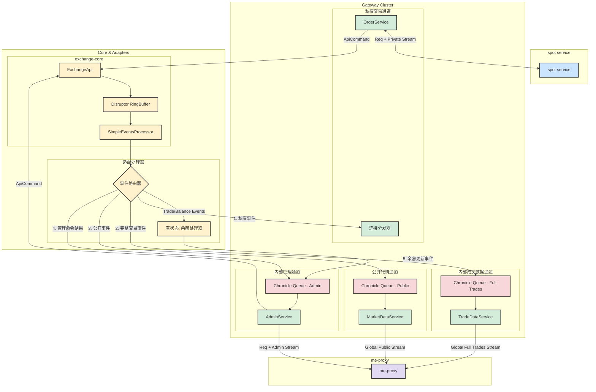

# 网关架构设计 (V4 - Final)

本文档详细描述了基于 gRPC 的、按功能和数据隐私级别分离的网关架构。该架构旨在为 `exchange-core` 提供一个高性能、高可靠、职责清晰、安全合规的现代化接口。

## 1. 核心设计原则

*   **职责与数据分离**: 将不同性质的服务（私有交易、内部数据、公开行情、后台管理）物理隔离到不同的端口/服务中。
*   **统一事件流**: 每个网关的下游都对应一个独立的、持久化的事件队列，保证了消息的严格有序和可靠的断线续传。
*   **有状态的适配处理器**: 引入 `余额处理器` 等有状态的中间件，将核心引擎产生的底层事件，适配成上层应用更易于消费的、包含状态的事件。
*   **数据分级**: 根据目标受众（外部客户、内部服务）对数据进行脱敏处理。

## 2. 整体架构图

## 3. 组件详细说明

### 3.1. `OrderGateway` (私有交易通道)
*   **职责**: 为 spot service 提供交易执行和私有事件通知。
*   **模式**: 每个连接都是一个独立的会话。客户端通过一个 gRPC 连接，既可以发送请求，也可以在流上接收私有回报。

### 3.2. `AdminGateway` (内部管理通道)
*   **职责**: 为 me-proxy (及其他内部管理员) 提供账户管理和状态查询功能。
*   **模式**: 统一事件流模式。
    *   **上游**: 管理员通过 me-proxy 发送请求（如 `adjustBalance`）。
    *   **下游**: 在同一个流上，顺序接收到 `CommandResult` (命令的直接结果) 和 `BalanceUpdateEvent` (包含最新余额的状态更新)。
*   **核心组件**:
    *   `Chronicle Queue - Admin`: 一个专用的、持久化的队列，存储所有需要推送给管理员的事件，保证严格有序。

### 3.3. `TradeDataGateway` (内部成交数据通道)
*   **职责**: 向 me-proxy (及其他内部服务) 提供**完整、未脱敏**的全局成交数据流。

### 3.4. `MarketDataGateway` (公开行情通道)
*   **职责**: 向 me-proxy 提供公开的行情数据流，再由 me-proxy 转发给 spot service。
*   **数据**: 包含 L2 订单簿更新和**已脱敏**的全局成交记录。

### 3.5. 核心适配层

#### `事件路由器` (EventRouter)
这是整个下游设计的核心，它紧跟在 `SimpleEventsProcessor` 之后。
*   **职责**: 检查每一个从核心引擎产生的事件，并将其无状态地分发到多个下游：
    1.  **路由到 `OrderGateway`**: 将私有事件（如 `TradeEvent`）直接派发给 `OrderGateway` 的 `连接分发器`。
    2.  **路由到 `TradeDataGateway`**: 将完整的 `TradeEvent` 写入其专用队列。
    3.  **路由到 `MarketDataGateway`**: 将脱敏后的 `TradeEvent` 和 `OrderBook` 更新写入其专用队列。
    4.  **路由到 `AdminGateway`**: 将管理类命令的 `CommandResult` 写入 `AdminEvents` 队列。
    5.  **路由到 `余额处理器`**: 将所有能影响余额的事件（`TradeEvent` 和管理类 `CommandResult`）发送给 `余额处理器`。

#### `余额处理器` (Balance Processor)
*   这是一个**有状态的**服务组件，是实现 `AdminGateway` 良好体验的关键。
*   **职责**:
    1.  在内部维护所有用户账户的**最新余额快照**。
    2.  监听来自 `事件路由器` 的事件。
    3.  根据事件内容，实时计算并更新内部的余额快照。
    4.  生成一个包含**最新全量余额**的 `BalanceUpdateEvent` 事件。
    5.  将这个 `BalanceUpdateEvent` 事件写入 `AdminGateway` 的 `AdminEvents` 队列。
