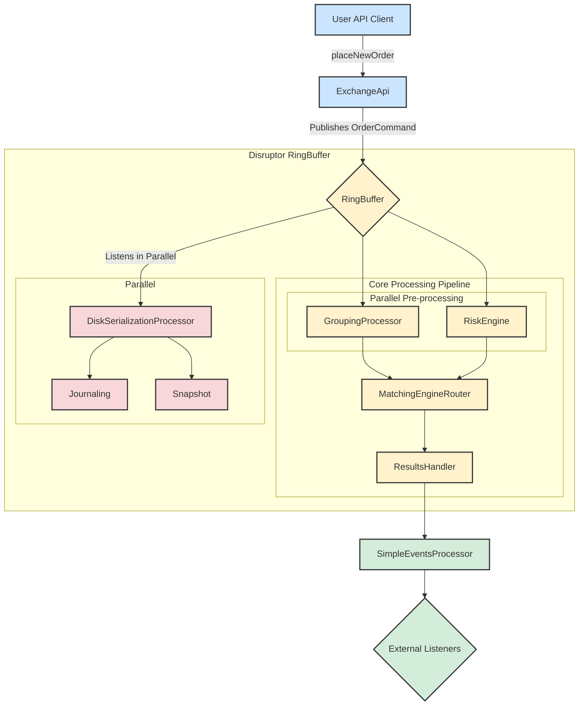

# System Architecture and Order Flow

This document describes the architecture of the exchange core, focusing on the life cycle of an order command.

## Order Flow Diagram

The following diagram illustrates the journey of a command from the API to the final event consumers, including the persistence and recovery mechanism.



**Component Index:**
*   [ExchangeApi](#component-exchangeapi)
*   [GroupingProcessor](#component-groupingprocessor)
*   [RiskEngine](#component-riskengine)
*   [MatchingEngineRouter](#component-matchingenginerouter)
*   [ResultsHandler](#component-resultshandler)
*   [SimpleEventsProcessor](#component-simpleeventsprocessor)
*   [DiskSerializationProcessor](#component-diskserializationprocessor)

## Component Descriptions

Here is a detailed breakdown of each component's role in the processing pipeline:

<h3 id="component-client">Client</h3>

*   **User API Client**: Represents any external application or user script that interacts with the exchange. It initiates actions by sending commands, such as placing or canceling orders.

<h3 id="component-core">Exchange Core (Disruptor RingBuffer)</h3>

This is the high-performance, low-latency core of the system, built on the LMAX Disruptor pattern. The entire processing pipeline is configured and orchestrated in the `ExchangeCore.java` class.
*   **Core Class**: `src/main/java/exchange/core2/core/ExchangeCore.java`

### ExchangeApi <a name="component-exchangeapi"></a>

The public-facing gateway to the exchange. It provides a user-friendly API and is responsible for translating external calls (e.g., `placeNewOrder`) into the internal `OrderCommand` format. It then publishes these commands onto the `RingBuffer` for processing.
*   **Key Class Location**: `src/main/java/exchange/core2/core/ExchangeApi.java`

### RingBuffer <a name="component-ringbuffer"></a>

The central data structure of the Disruptor framework. It's a pre-allocated circular buffer where `OrderCommand` objects live. All processing stages (processors) operate on the objects directly within this buffer, which enables lock-free, high-throughput communication between components.

### GroupingProcessor (Stage 1, Parallel) <a name="component-groupingprocessor"></a>

As **one of the parallel processors** in Stage 1, its primary function is to batch incoming commands into groups. This is a performance optimization that improves throughput by reducing the overhead of processing each command. It is not concerned with the business content of commands but only defines the "batch" boundaries for downstream processors.
*   **Key Class Location**: `src/main/java/exchange/core2/core/processors/GroupingProcessor.java`

### RiskEngine (Stage 1, Parallel) <a name="component-riskengine"></a>

As the **other parallel processor** in Stage 1, it is responsible for pre-trade risk management and user account state. It is a stateful component that inspects every command within a batch. When it receives a `PLACE_ORDER` command, it checks if the user has sufficient funds or margin to cover the order and rejects any command that fails these checks.
*   **Key Class Location**: `src/main/java/exchange/core2/core/processors/RiskEngine.java`

### MatchingEngineRouter (Stage 2) <a name="component-matchingenginerouter"></a>

The **Stage 2** processor and the heart of the matching logic. It must wait for the **same command** to be processed by both `GroupingProcessor` and `RiskEngine` before it can begin. It takes commands that have passed risk checks and routes them to the appropriate `IOrderBook` instance for matching. The outcomes are attached to the `OrderCommand` as a chain of `MatcherTradeEvent` objects.
*   **Key Class Location**: `src/main/java/exchange/core2/core/processors/MatchingEngineRouter.java`

### ResultsHandler (Stage 3) <a name="component-resultshandler"></a>

The final processor in the Disruptor pipeline. Its role is simple but crucial: it takes the fully processed `OrderCommand`—now enriched with a final result code and a chain of matcher events—and passes it to the designated downstream event consumer.
*   **Key Class Location**: `src/main/java/exchange/core2/core/processors/ResultsHandler.java`

<h3 id="component-events">Event Handling</h3>

### SimpleEventsProcessor <a name="component-simpleeventsprocessor"></a>

This component acts as the primary downstream consumer. It receives the processed `OrderCommand` from the `ResultsHandler` and translates the internal, complex data structures into clean, discrete events suitable for external systems. It "unpacks" the command to produce `CommandResult` (the high-level outcome), `TradeEvent` (detailed trade information), and `OrderBook` (market data updates).
*   **Key Class Location**: `src/main/java/exchange/core2/core/SimpleEventsProcessor.java`

### External Listeners <a name="component-external-listeners"></a>

This represents the final destination for the events generated by the `SimpleEventsProcessor`. These are the client-side applications, databases, UI frontends, or analytics systems that subscribe to the event stream to stay synchronized with the state of the exchange.

<h3 id="component-persistence">Persistence & Recovery</h3>

### DiskSerializationProcessor <a name="component-diskserializationprocessor"></a>

This is a **parallel** processor that operates independently of the core processing pipeline. Its purpose is to ensure system **persistence** and **disaster recovery** capabilities without slowing down the core trading performance. Its working model is the cornerstone of the entire system's reliability.
*   **Key Class Location**: `src/main/java/exchange/core2/core/processors/journaling/DiskSerializationProcessor.java`
    *   **Journaling**: Like a flight recorder, it listens to and serializes every state-changing `OrderCommand`, writing it to a disk-based log file with high-efficiency sequential writes.
    *   **Snapshotting**: It is responsible for receiving the complete state from the core business engines (`RiskEngine`, `MatchingEngineRouter`) and saving it as a snapshot file.
    *   **Recovery Mechanism**: When the system restarts, it can first load the latest snapshot and then replay all subsequent transaction logs to restore the system's memory to its final state before the crash.

    For a complete, in-depth analysis of its working principles, flush mechanisms, file formats, and recovery procedures, please refer to the dedicated documentation:
    *   **[Deep Dive: Trading Engine Data Recovery Mechanism](./DATA_RECOVERY.md)**

---

## API Usage: `ExchangeApi` Deep Dive

The `ExchangeApi` class serves as the entry point and facade for the entire trading core. It provides a clear, user-friendly interface for external clients, abstracting away the complexities of the underlying Disruptor framework. Its key responsibilities include:

1.  **API Facade**: It hides the complexity of interacting with the Disruptor `RingBuffer`. Developers call simple methods like `submitCommand(ApiPlaceOrder cmd)` without needing to understand the internal mechanics.
2.  **Command Translation & Publishing**: Its core duty is to translate `ApiCommand` objects into the internal `OrderCommand` format. It uses a predefined `EventTranslator` to copy fields into a pre-allocated `OrderCommand` on the `RingBuffer` and then publishes it, making it visible to the processing pipeline.
3.  **Asynchronous Result Handling**: For async calls, `ExchangeApi` maintains a map of `promises`. It stores a `CompletableFuture` callback against a command's sequence number. When the command is fully processed, the `ResultsHandler` invokes `ExchangeApi.processResult()`, which finds the corresponding callback and completes the future, delivering the result to the original caller.

#### `submitCommandAsync` vs `submitCommandAsyncFullResponse`

The key difference lies in the amount of information returned in the `CompletableFuture`:

*   **`submitCommandAsync`**:
    *   **Returns**: `CompletableFuture<CommandResultCode>`
    *   **Content**: Only the final status code (`SUCCESS`, `RISK_NSF`, etc.).
    *   **Use Case**: Ideal when you only need to know if an operation succeeded or failed, without needing the details of its side effects.

*   **`submitCommandAsyncFullResponse`**:
    *   **Returns**: `CompletableFuture<OrderCommand>`
    *   **Content**: The entire, fully-processed `OrderCommand` object, which includes the `resultCode`, a chain of `MatcherTradeEvent`s (trades), and potentially `L2MarketData`.
    *   **Use Case**: Essential when you need the full details of the operation's outcome, such as the average fill price and trade-by-trade specifics of a market order.

#### Asynchronous Usage Pattern

The standard way to interact with the API asynchronously is:

1.  **Call an `async` method**: `CompletableFuture<OrderCommand> future = exchangeApi.submitCommandAsyncFullResponse(placeOrderCmd);`
2.  **Process the `Future`**:
    *   **Blocking Wait (for tests)**: `OrderCommand result = future.join();`
    *   **Non-Blocking Callback (recommended)**: `future.thenAccept(result -> { /* process result here */ });`

---

## Disruptor Pipeline Orchestration

The `RingBuffer` itself is just a high-performance, lock-free circular queue responsible for storing and passing data (in this case, `OrderCommand` objects). **It does not directly "orchestrate" the stages; instead, this is achieved through a mechanism called a "Dependency Barrier."**

This orchestration process is defined in the `ExchangeCore` constructor, which can be thought of as building a "dependency graph." Let's break it down:

1.  **Core Concepts: Sequence and Barrier**
    *   **Sequence**: Each processor has its own `Sequence` object. This acts as a "counter" for the position (sequence number) in the `RingBuffer` that the processor has currently handled.
    *   **SequenceBarrier**: This is a barrier. Before processing the next item, a processor must wait for the `Sequence` of all its prerequisite processors to advance past that item's position. This barrier ensures that a processor does not handle data that has not yet been processed by its dependencies.

2.  **Orchestrating Stages 1, 2, and 3**
    In `ExchangeCore.java`, you will see code like this (this is the standard LMAX Disruptor setup pattern):
    ```java
    // 1. Create an initial barrier from the RingBuffer, which all Stage 1 processors depend on.
    SequenceBarrier barrier1 = ringBuffer.newBarrier();

    // 2. Create Stage 1 processors (Grouping, Risk), both waiting for barrier1.
    //    - GroupingProcessor(barrier1)
    //    - RiskEngine(barrier1)
    //    These two processors can execute in parallel as they have no dependency on each other, only on the raw data from the RingBuffer.

    // 3. Create a Stage 2 barrier that waits for all Stage 1 processors to complete.
    //    This barrier will track the Sequences of GroupingProcessor and RiskEngine.
    SequenceBarrier barrier2 = ringBuffer.newBarrier(
        groupingProcessor.getSequence(), 
        riskEngine.getSequence()
    );

    // 4. Create the Stage 2 processor (MatchingEngine), which waits for barrier2.
    //    - MatchingEngineRouter(barrier2)
    //    This means MatchingEngineRouter must wait until both GroupingProcessor and RiskEngine
    //    have finished processing the same OrderCommand before it can begin.

    // 5. Create a Stage 3 barrier that waits for the Stage 2 processor to complete.
    SequenceBarrier barrier3 = ringBuffer.newBarrier(
        matchingEngineRouter.getSequence()
    );

    // 6. Create the Stage 3 processor (ResultsHandler), which waits for barrier3.
    //    - ResultsHandler(barrier3)
    ```

3.  **Workflow (Example with one `OrderCommand`)**
    *   **Publish**: `ExchangeApi` publishes an `OrderCommand` to sequence number `N` on the `RingBuffer`.
    *   **Stage 1**:
        *   `GroupingProcessor` and `RiskEngine` are both waiting for `barrier1`. Once sequence `N` is available, they can both start processing the command in `RingBuffer[N]`.
        *   After they each finish processing, they update their own `Sequence` to `N`.
    *   **Stage 2**:
        *   `MatchingEngineRouter` waits for `barrier2`. `barrier2` checks the `Sequence` of both `GroupingProcessor` and `RiskEngine`. Only when both sequences have reached or surpassed `N` does `barrier2` give the green light.
        *   Once cleared, `MatchingEngineRouter` processes the command at `RingBuffer[N]`. After completion, it updates its `Sequence` to `N`.
    *   **Stage 3**:
        *   `ResultsHandler` waits for `barrier3`. `barrier3` checks the `Sequence` of `MatchingEngineRouter`. Once it reaches `N`, `barrier3` gives the green light.
        *   `ResultsHandler` begins processing, completing all operations for this command.

**Summary**
The `RingBuffer` is like a physical assembly line conveyor belt, while **orchestration is implemented via the `SequenceBarrier`**. Each `SequenceBarrier` acts like a "checkpoint" on the assembly line, ensuring that a part (`OrderCommand`) can only move to the next station after all previous stations (dependent processors) have completed their work on it.

In this way, Disruptor elegantly defines the dependencies and execution order among processors, achieving an efficient, lock-free, parallel, and serial processing flow.

---

## Component Deep Dive: GroupingProcessor

`GroupingProcessor` is the **first processor** in the Disruptor pipeline and serves as a critical **performance optimization component**. Its core idea is simple: **aggregate individual commands into batches and then pass the entire batch to the next processor.**

This is like ordering at a fast-food restaurant. If the kitchen prepares one burger for every single customer order, it's inefficient. But if the cashier (`GroupingProcessor`) collects orders for 10 consecutive burgers and hands them to the kitchen (`RiskEngine`) all at once, the kitchen can operate like an assembly line, greatly improving efficiency.

Let's delve into its mechanics:

1.  **Objective: Increase Throughput**
    *   In ultra-low-latency systems, the fixed overhead of processing a single event (like method calls, cache misses, etc.) can become significant.
    *   By grouping commands, `GroupingProcessor` "amortizes" the processing cost over multiple commands. Downstream processors (like `RiskEngine`) only need to be woken up once to handle a batch of commands, rather than once for each command. This drastically reduces context switching and inter-processor communication overhead, thereby significantly boosting the system's overall throughput.

2.  **How It Works**
    *   `GroupingProcessor` receives an `OrderCommand` from the `RingBuffer` in its `onEvent` method.
    *   It does **not** immediately pass this command on; instead, it holds onto it.
    *   It checks if the command is a "**trigger signal**." In `exchange-core`, this is typically a `GROUPING_FLUSH_SIGNAL` command or a special `endOfBatch` flag.
    *   When `GroupingProcessor` receives a trigger signal, or the number of held commands reaches a preset threshold (`groupingMaxBatchSize`), or the waiting time exceeds a certain threshold (`groupingMaxBatchDelayNs`), it marks the end of the current batch of accumulated commands and then updates its `Sequence`.
    *   This `Sequence` update triggers the `SequenceBarrier`, letting the downstream `RiskEngine` know: "All commands from the end of the last batch to this point are ready; you can start processing them."

3.  **Batch Boundaries**
    There are two main conditions that trigger a batch "flush", both implemented within the `processEvents()` method of `GroupingProcessor.java`:

    *   **Size Threshold**: While processing events, if the number of accumulated commands in a batch (`msgsInGroup`) reaches the limit (`msgsInGroupLimit`), the processor forces a switch to the next batch.
        ```java
        if (msgsInGroup >= msgsInGroupLimit && cmd.command != OrderCommandType.PERSIST_STATE_RISK) {
            groupCounter++;
            msgsInGroup = 0;
        }
        ```

    *   **Time Threshold**: When there are no new events in the `RingBuffer` and the processor is idle, it checks an internal timer. If the current time has exceeded the maximum waiting time for the batch (`groupLastNs`), it forces the current batch to end, preventing excessive command latency.
        ```java
        } else {
            // Executes when the processor is idle
            final long t = System.nanoTime();
            if (msgsInGroup > 0 && t > groupLastNs) {
                // Switch group if time expired and batch is not empty
                groupCounter++;
                msgsInGroup = 0;
            }
        }
        ```

**Summary**
`GroupingProcessor` is a classic **batch processing** optimization. It sacrifices the **lowest possible latency** for a single command (as it has to wait to be grouped) in exchange for **higher overall system throughput**. In scenarios like financial trading, which require handling a massive volume of concurrent requests, this trade-off is very common and effective. It forms Stage 1 along with `RiskEngine`, preparing batches of pre-processed commands for the subsequent matching stage.

---

## Component Deep Dive: RiskEngine

The `RiskEngine` is the **second gate** in the trading pipeline and the **first true business logic gate**. It is a **stateful** component whose core responsibility is **pre-trade risk checks and account state management**. Think of it as a bank teller who must verify your identity, check if your account is active, and ensure you have sufficient funds before processing a transfer request (placing an order).

Its work is divided into two main parts: **pre-processing (Hold)** and **post-processing (Release)**, corresponding to the `preProcessCommand` and `handlerRiskRelease` methods.

### Command Types Handled by `RiskEngine`

The `RiskEngine` is a **mandatory stop** for almost all commands before they reach the matching engine. It uses a large `switch` statement (in the `preProcessCommand` method) to differentiate and apply logic for various command types:

1.  **`PLACE_ORDER`**: This is the most complex and critical logic.
    *   **Checks**: Verifies the user exists, the symbol is valid, and the order quantity/price are legal.
    *   **Calculation**: Computes the required funds (margin) to hold based on the order's side, price, and quantity.
    *   **Hold**: Transfers the required funds from the user's available balance (`balance`) to the held amount (`heldAmount`).
    *   **Rejection**: If the available balance is insufficient, it immediately sets `resultCode = RISK_NSF` (Not Sufficient Funds) and terminates the command's processing.

2.  **`CANCEL_ORDER`**:
    *   **Checks**: Verifies the order exists and belongs to the user.
    *   **Note**: It does **not** immediately release the held funds. This is because it doesn't know if the order was partially filled at the moment of cancellation. The release of funds must await the final result from the matching engine.

3.  **`MOVE_ORDER`**:
    *   **Checks**: Same as `CANCEL_ORDER`.
    *   **Processing**: It handles the old order like a `CANCEL_ORDER` and the new-priced order like a `PLACE_ORDER`, but this is all at the "pre-processing" level. The actual fund changes depend on the matching result.

4.  **`ADJUST_BALANCE`**:
    *   **Checks**: Verifies the user exists.
    *   **Processing**: Directly modifies the user's `balance`. This is a purely administrative action that does not proceed to the matching engine.

#### A Note on "Market Buy by Quantity"

The `RiskEngine` is designed to strictly differentiate between "by amount" and "by quantity" market orders. To understand the challenges, design trade-offs, and the final best-practice solution for the complex "Market Buy by Quantity" feature, please refer to the dedicated deep-dive document:

*   **[Deep Dive: Designing and Implementing Market Buy by Quantity](./DEEP_DIVE_MARKET_BUY_BY_QUANTITY.md)**

### Core Data Structures

All of `RiskEngine`'s logic revolves around two core, in-memory `Map`s (specifically `LongObjectHashMap` for performance):

1.  **`users` (`LongObjectHashMap<UserProfile>`)**:
    *   **Key**: `uid` (User ID)
    *   **Value**: A `UserProfile` object, containing all information for that user.

2.  **`accounts` (`IntObjectHashMap<UserCurrencyAccount>`)**:
    *   This is a `Map` inside the `UserProfile`.
    *   **Key**: `currency` code
    *   **Value**: A `UserCurrencyAccount` object, which stores the user's financial information for a **specific currency**, including:
        *   `balance`: The total balance.
        *   `heldAmount`: The amount frozen for open orders.
        *   The **available balance** is calculated as `balance - heldAmount`.

### Risk Validation Failure (The "Short-Circuit" Mechanism)

When a `RiskEngine` validation fails, a **"short-circuit"** operation occurs. This is a critical performance and safety feature of the trading system.

Here is the process:

1.  **Set Rejection Code**: In the `preProcessCommand` method, if a `PLACE_ORDER` command fails validation for any reason (most commonly, insufficient funds or NSF), the `RiskEngine` immediately sets the `resultCode` on the `OrderCommand` object to a specific failure code, such as `RISK_NSF`.

2.  **Skip Matching**: When the `MatchingEngineRouter` receives this command, it checks the `resultCode`. Seeing that the command has already been marked as failed, it **completely skips** all matching logic for it and passes the command "as-is" to the next stage.

3.  **Maintain Process Integrity**: Even though the command is rejected, it **still completes its journey through the entire pipeline** instead of being removed midway. This ensures the Disruptor's `Sequence` mechanism is not disrupted and all processors remain synchronized.

4.  **Provide Clear Feedback**: Ultimately, the `ResultsHandler` passes on the command with its failure code, and the client receives a precise reason for the failure (e.g., "insufficient funds") rather than a generic "processing error."

This "short-circuit" mechanism is an elegant design for high-performance systems, as it quickly rejects invalid operations without compromising the integrity and consistency of the processing pipeline.

### Summary: The Essence of `RiskEngine`

The `RiskEngine` is essentially an **in-memory, high-performance state machine for accounts and positions**.

*   Through its **hold mechanism (`heldAmount`)**, it ensures that a user's funds are safely reserved before an order enters the "black box" of the matching engine.
*   Through its **two-stage processing (`preProcessCommand` and `handlerRiskRelease`)**, it guarantees that no matter the matching outcome (full fill, partial fill, or no fill), the user's final account state remains perfectly consistent with the result.

This design makes the `RiskEngine` the **cornerstone of financial security** for the entire trading system.

---

## Component Deep Dive: MatchingEngineRouter

The `MatchingEngineRouter` is the **third gate** in the Disruptor pipeline and the "heart" of the entire trading system, responsible for executing the core function of **order matching**.

If the `RiskEngine` is the "treasurer," then the `MatchingEngineRouter` is the "trader." Its responsibilities sound simple but are implemented with great subtlety.

### Core Responsibilities: Routing and Matching

The name `MatchingEngineRouter` encompasses its two core duties:

1.  **Router**:
    *   A system can have hundreds or thousands of trading pairs (BTC/USDT, ETH/USDT, ...). Each pair has its own independent **Order Book**.
    *   The primary task of the `MatchingEngineRouter` is to act like a traffic controller, **dispatching** an order to the correct order book based on the `symbolId` in the `OrderCommand`.
    *   It maintains an internal `Map` where the `key` is the `symbolId` and the `value` is the corresponding `IOrderBook` instance.

2.  **Matching Engine**:
    *   Once an order is dispatched to a specific `IOrderBook` instance, the real matching logic begins.
    *   An `IOrderBook` is a data structure that maintains all outstanding buy and sell orders for that symbol, sorted by price-time priority.
    *   **Matching Process**:
        *   **Is the new order a buy?**: It looks for the lowest-priced sell order in the book. If the new order's bid price >= the lowest ask price, a match occurs! It continues to match against the next-lowest sell order until the order is fully filled or no more suitable counter-orders can be found.
        *   **Is the new order a sell?**: It looks for the highest-priced buy order. If the new order's ask price <= the highest bid price, a match occurs! It then continues to the next-highest buy order.
        *   **If no counter-order is found?**: The new order is placed on the order book, becoming a new Maker Order, waiting for another order to match with it.

### Key Interactions of `MatchingEngineRouter`

1.  **Receiving Input**:
    *   It receives `OrderCommand`s that have already passed through the `RiskEngine` (risk checks) and `GroupingProcessor` (batching).
    *   **Important**: It must wait for the **same** `OrderCommand` to be processed by both preceding processors before it can start. This is guaranteed by the Disruptor's `SequenceBarrier`.

2.  **Processing Logic**:
    *   **Check for "Short-Circuit" Signal**: Before doing anything, it checks the `resultCode` of the `OrderCommand`. If the `RiskEngine` has already marked the order as failed (e.g., `RISK_NSF`), the `MatchingEngineRouter` will **completely skip** all matching logic and pass the failed command on as-is.
    *   **Execute Matching**: For valid orders, it calls the `match(OrderCommand)` method of the corresponding `IOrderBook`.
    *   **Record Results**: During matching, the `IOrderBook` generates a series of **`MatcherTradeEvent`s**. These events detail every aspect of each match (whose order was filled, price, quantity, etc.). The `MatchingEngineRouter` links these events together like a linked list and attaches them to the `OrderCommand`.

3.  **Producing Output**:
    *   After processing, the `MatchingEngineRouter` passes the "enriched" `OrderCommand` (now containing the matching results) to the next and final stage of the pipeline: the `ResultsHandler`.

### `IOrderBook` Implementations

`exchange-core` provides two implementations of `IOrderBook`, which have vastly different design philosophies and performance characteristics. To fully understand the internal workings, data structures, and performance trade-offs of these two implementations, please refer to the dedicated deep-dive document:

*   **[Deep Dive: The Two Implementations of the Order Book](./DEEP_DIVE_ORDERBOOK.md)**

In short:
*   **`OrderBookNaiveImpl`**: Uses a standard `TreeMap`, is easy to understand, and is suitable for getting started and for testing.
*   **`OrderBookDirectImpl`**: Uses a custom linked list and radix tree, combined with object pooling, and is built for extreme performance, making it the preferred choice for production environments.

### Summary

The `MatchingEngineRouter` is the central hub connecting **risk control** and **trade execution**.

*   It acts as a **dispatcher**, ensuring every order finds its correct arena (the order book).
*   It drives the **executor** (`IOrderBook`) to complete the core value exchange (order matching).
*   It is also a **recorder**, clearly documenting every detail of a match in `MatcherTradeEvent`s, providing an immutable basis for downstream clearing and settlement.

Its design embodies the Single Responsibility Principle: it only cares about "matching" and does it to perfection. It is not concerned with user balances (that's the `RiskEngine`'s job) or how the final result is communicated to the user (that's the `ResultsHandler`'s job).

---

## Component Deep Dive: ResultsHandler (Stage 3)

The `ResultsHandler` is the **final stage** of the entire matching process. Its core responsibility is very clear: **to take the fully processed command results and market events from the Disruptor Ring Buffer and deliver them to the outside world.**

You can think of it as the "exit" or "loudspeaker" of the matching engine. All internal processing (risk checks, matching, settlement) is complete, and the `ResultsHandler` is responsible for publishing the final results.

### 1. Core Functionality

The core functionality of the `ResultsHandler` is implemented in its `onEvent` method, which primarily does two things:

1.  **Handle Grouping Control Commands (`GROUPING_CONTROL`)**:
    *   This is a special internal command used to control whether the `ResultsHandler` should process events.
    *   If a `GROUPING_CONTROL` command is received, it checks the `orderId` field to enable or disable event processing.
    *   This mechanism is mainly used for **batch processing and the two-step processing model** of the matching engine. In some scenarios, the system needs to process a batch of related commands (e.g., an IOC order and all the trade events it triggers) completely before publishing the results externally, ensuring consistency for external observers. `GROUPING_CONTROL` is used to mark the "start" and "end" of such a batch.

2.  **Consume Final Results (`resultsConsumer.accept`)**:
    *   If event processing is enabled, the `ResultsHandler` calls the `resultsConsumer`.
    *   The `resultsConsumer` is a **consumer function** injected via the constructor. This function is where the results are actually handled.
    *   In the `ExchangeCore` implementation, this `resultsConsumer` is typically the `DisruptorExceptionHandler`, which delivers the processing result (success or failure code) and market events (trades, rejections, cancellations) back to the original API caller via a `CompletableFuture` or pushes them to market data subscribers via the `IEventsHandler` interface.

### 2. Position in the Overall Flow

The `ResultsHandler` is at the end of the processing flow. When a command has passed through all preceding stages (grouping, risk control, matching), it finally reaches the `ResultsHandler`. By this point, the `OrderCommand` object contains all the processing results. The `ResultsHandler` passes this complete `OrderCommand` object to the `resultsConsumer`, which then notifies the API caller and broadcasts market data.

### 3. Summary

The `ResultsHandler` is the endpoint of the matching process. Its role can be summarized as:

1.  **Final Exit**: It is the sole channel through which all command results and market events leave the Disruptor Ring Buffer.
2.  **Flow Control**: Through the `GROUPING_CONTROL` command, it allows for fine-grained control over event publication, supporting batch and atomic result delivery.
3.  **Decoupling**: It decouples the logic of "how to handle results" (`resultsConsumer`) from the processing flow itself. The `ResultsHandler` is only concerned with "when" and "if" to publish, while the `resultsConsumer` is responsible for "how" to publish.

---

## Component Deep Dive: SimpleEventsProcessor

The `SimpleEventsProcessor` acts as the bridge between the **core processing logic** and the **outside world**. Its role is crucial: **it is a translator and a dispatcher**.

After the `ResultsHandler` hands over a fully processed `OrderCommand`, the core task of the `SimpleEventsProcessor` is to **translate** this internal, complex `OrderCommand`—which contains all processing traces—into clean, discrete, and externally understandable events, and then **dispatch** them.

### Core Entry Point: The `accept` Method

`SimpleEventsProcessor` implements the `ObjLongConsumer<OrderCommand>` interface, so its entry point is the `accept(OrderCommand cmd, long seq)` method. This method is the starting point for all its logic and sequentially performs three major tasks:

1.  `sendCommandResult(cmd, seq)`: **Sends the command processing result**
2.  `sendTradeEvents(cmd)`: **Sends trade-related events**
3.  `sendMarketData(cmd)`: **Sends market data**

Let's break down these three core methods.

### 1. `sendCommandResult`: Translating and Sending the "Final Command Result"

The goal of this method is to inform the API caller: "I've finished processing the command you submitted, and here is the result..."

*   **How it Works**:
    1.  It uses a `switch` statement to determine the original command's type (`PLACE_ORDER`, `CANCEL_ORDER`, etc.).
    2.  Based on the command type, it **re-creates** the original `ApiCommand` object (e.g., `ApiPlaceOrder`). This is done to convert the complex internal `OrderCommand` back into the clean, request-parameter-only command object from the API layer.
    3.  It then packages this newly created `ApiCommand`, the final `resultCode` (success, failure, reason code), and the sequence number `seq` into an `IEventsHandler.ApiCommandResult` object.
    4.  Finally, it calls `eventsHandler.commandResult(...)` to send this result object out. The `ExchangeApi` listens for this event and uses the `seq` to find the corresponding `CompletableFuture`, allowing the asynchronous caller to receive the result.

*   **Core Purpose**: **Decoupling**. It separates the highly optimized internal data structure (`OrderCommand`) from the clean API data structure (`ApiCommand`), shielding external callers from the complexities of the internal implementation.

### 2. `sendTradeEvents`: Translating and Sending "Matching Events"

This is the most complex part. The `MatchingEngine` produces a series of `MatcherTradeEvent`s during matching, which are linked together like a list on the `OrderCommand`. The task of `sendTradeEvents` is to parse this list and translate it into two types of external events: `TradeEvent` and `ReduceEvent`.

*   **Handling `REDUCE` Events**:
    *   If the `MatcherTradeEvent` type is `REDUCE` (typically generated by a `REDUCE_ORDER` command), it directly creates and sends an `IEventsHandler.ReduceEvent`. This is a relatively simple path.

*   **Handling `TRADE` and `REJECT` Events**:
    *   This is the more common path. The method iterates through the `MatcherTradeEvent` list.
    *   **`TRADE` Event**: If the event type is `TRADE`, it extracts the information (counterparty order ID, price, quantity, etc.), creates an `IEventsHandler.Trade` object, and adds it to a temporary `trades` list.
    *   **`REJECT` Event**: If the event type is `REJECT` (e.g., a GTC order's remainder is rejected after matching because it can't be placed on the book), it creates an `IEventsHandler.RejectEvent`.
    *   **Packaging and Sending**: After iteration:
        *   If the `trades` list is not empty, it packages all `Trade` objects into a single, comprehensive `IEventsHandler.TradeEvent`. This master event contains macro-level information like the Taker's order ID, total filled quantity, and whether the order was fully filled, along with a `trades` list containing all specific fill details. It is then sent via `eventsHandler.tradeEvent(...)`.
        *   If a `RejectEvent` was encountered, it is sent separately via `eventsHandler.rejectEvent(...)`.

*   **Core Purpose**: **Structuring and Aggregation**. It transforms the raw, linear event stream from the matching engine into structured, business-meaningful events. For example, an external system can receive all trades resulting from a single market order at once, without needing to piece them together.

### 3. `sendMarketData`: Translating and Sending "Order Book Market Data"

If a command's execution (like placing, canceling, or matching an order) causes a change in the order book, the `MatchingEngine` attaches the latest L2 market data snapshot (`L2MarketData`) to the `OrderCommand`. The responsibility of `sendMarketData` is to process this snapshot.

*   **How it Works**:
    1.  It checks if `cmd.marketData` is null.
    2.  If not, it iterates through the `ask` and `bid` arrays in `marketData` (which are raw arrays optimized for performance).
    3.  For each price level, it creates a more user-friendly `IEventsHandler.OrderBookRecord` object (containing the price, total volume at that price, and number of orders).
    4.  Finally, it packages all `ask` and `bid` records into an `IEventsHandler.OrderBook` object and sends it out via `eventsHandler.orderBook(...)`.

*   **Core Purpose**: **Formatting**. It converts the internal, performance-optimized, array-based L2 data into an object-based list format that is easier for external systems (like a UI or a market data bot) to consume.

### Summary

The `SimpleEventsProcessor` is the bridge connecting the **core processing logic** to the **outside world**. Its existence allows:

*   **The Core to Focus on Performance**: Internal components can use various highly optimized, non-object-oriented data structures.
*   **The Outside World to Remain Simple**: External systems receive events that are clean, independent, and easy to understand.

It acts like a press secretary, taking the complex and messy raw reports from the battlefield (`MatchingEngine`) and turning them into well-organized press releases (`ApiCommandResult`), feature stories (`TradeEvent`), and data charts (`OrderBook`) for the world's journalists (external listeners).
